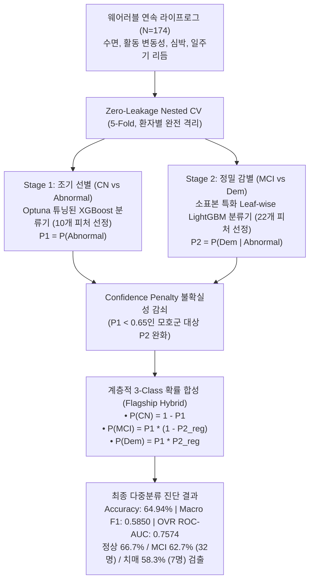
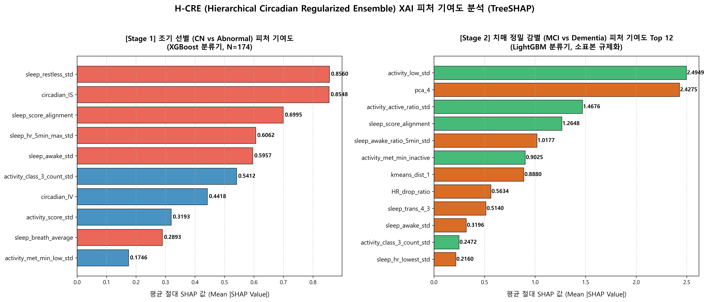

# H-CRE (계층적 생체리듬 정규화 앙상블) 3-Class 다중분류 및 Final XGBoost(R-XGB) 세부 지표별 심층 통합 기술 보고서 (Integrated Master Report)

## 1. 연구 개요 및 임상적 문제 정의

본 연구는 웨어러블 스마트워치 및 스마트 링에서 수집된 장기 일상 라이프로그와 24시간 일주기 생체리듬(Circadian Rhythm) 데이터를 활용하여, 인지기능 저하의 진행 단계를 **정상(CN), 경도인지장애(MCI), 치매(Dementia)**의 3단계로 정밀 감별하는 **H-CRE (Hierarchical Circadian Regularized Ensemble, 계층적 생체리듬 정규화 앙상블) 머신러닝 프레임워크**를 구축하고, 이를 최종 제안 모델인 **Final XGBoost (R-XGB, Chapter 5)**와 세부 지표별로 심층 비교 검증한 통합 기술 보고서입니다.

특히 본 보고서에는 1단계 조기 선별(Stage 1)에 최고 재현율의 **XGBoost(10개 피처)**, 2단계 정밀 감별(Stage 2)에 최고 변별력의 **LightGBM(22개 피처)**을 결합한 **H-CRE Flagship Hybrid 아키텍처**의 5-Fold OOF 전수 검증 결과와 TreeSHAP 설명가능 AI(XAI) 기여도 분석 결과를 전면 수록하였습니다.



### 1.1. 다중분류(3-Class) 개발의 임상적 필요성
기존 인지장애 AI 연구는 대부분 **정상 vs 비정상**의 단순 2진 분류에 국한되어 있었습니다. 그러나 실제 의료 전달 체계에서는 다음의 치명적인 한계가 존재합니다:
1. **임상 중재 경로의 불일치**: 경도인지장애(MCI)는 조기 발견 시 생활습관 개선과 인지 훈련을 통해 정상 회복(Reversion)이 가능한 가역적 골든타임인 반면, 치매(Dementia)는 비가역적 신경퇴행 단계로 약물 투약과 가족 돌봄, 전문 요양 관리가 필수적입니다. 단순 이진 분류는 이 둘을 동일한 '환자'로 묶어 처리하므로 차별화된 맞춤형 치료 경로를 제시하지 못합니다.
2. **치매 소표본에 따른 '치매 실명' 현상**: 전체 표본 중 확진 치매 환자는 6.9%(12명)에 불과합니다. 평면적 다중 분류(Direct 3-Class)를 적용하면 다수 클래스인 정상(111명)과 MCI(51명)에 모델이 편향되어, 정작 가장 위험한 치매 환자를 거의 찾아내지 못하는 심각한 위음성이 발생합니다.

### 1.2. 핵심 해결 전략: H-CRE 아키텍처의 5대 기둥
H-CRE 모델은 이러한 임상적·데이터적 한계를 극복하기 위해 다음의 설계를 적용했습니다:
- **14종 핵심 생체리듬 도메인 피처 전면 적용**: 24시간 일주기(Circadian) 및 자율신경계 파생 지표 반영.
- **피험자별(Patient-level) Zero-Leakage Nested CV**: 1인 1행 구조에서 환자 단위 분할 및 전처리 격리 보장.
- **전진 선택법(Forward Selection) 기반 단계별 특화 피처 구성**: Stage 1에 10개, Stage 2에 22개 피처 최적화 선별.
- **플래그십 하이브리드 파이프라인 (Stage 1 XGBoost + Stage 2 LightGBM)**: 1단계 최고 재현율 모델과 2단계 최고 변별력 모델의 역할 분담.
- **치매 소표본 이중 규제화(Double Regularization)**: Stage 2 얕은 깊이 제약 + Stage 1 불확실군($P_1 < 0.65$) 대상 Confidence Penalty 감쇠.

---

## 2. 환자 코호트 및 데이터 무결성 전처리

### 2.1. 데이터 코호트 구성
- **데이터 파일 경로**: `patient_level_circadian_v3.csv`
- **표본 크기**: 총 174명 ($N=174$, 중복 없는 환자 단위 1인 1행 레코드, `EMAIL` 분리)
- **임상 진단 레이블 분포 (`original_label`)**:
  - **정상군 (CN, Normal Cognition, Class 0)**: 111명 (63.8%)
  - **경도인지장애 (MCI, Mild Cognitive Impairment, Class 1)**: 51명 (29.3%)
  - **치매 (Dem, Dementia, Class 2)**: 12명 (6.9%)
  - *인지이상군 전체 (Abnormal = MCI + Dem)*: 63명 (36.2%)

### 2.2. 검증 코호트 33명 일주기 피처 복원 무결성
과거 검증군 33명의 일주기 생체 지표 누락(0값) 문제를 `restore_33_circadian_features.py`를 통해 원천 1분 단위 시계열에서 완벽히 재추출하여 복원했습니다.
- 복원 전 누락자 수: 33명
- 복원 후 결측 및 0값 대상자: **0명 (174명 전원 정상 수치 확보)**
  - `circadian_IS` (일간 안정성): 0.1041 ~ 0.6044 (평균 0.2515, NaNs=0)
  - `circadian_IV` (일내 분절화): 0.1989 ~ 0.9961 (평균 0.5471, NaNs=0)
  - `circadian_RA` (상대 진폭): 0.1273 ~ 0.4564 (평균 0.2570, NaNs=0)
  - `sleep_wake_bouts_avg` (미세 각성): 2.0265 ~ 15.8772 (평균 6.5512, NaNs=0)

### 2.3. No-MMSE 엄격 배제 원칙
임상 인지평가 설문 점수(`Q1`~`Q30`, `TOTAL`, `MMSE_*`, `DIAG_SEQ`, `DOCTOR_NM`)와 식별자(`EMAIL`)를 입력 피처에서 100% 배제하여 순수 웨어러블 바이오마커 기반의 객관적 판별력을 보장했습니다.

### 2.4. 비지도 학습 기반 잠재 피처(PCA·K-Means·GMM) 생성 및 엄격한 누수 방지(Leakage-Free) 메커니즘

원본 환자 집계 데이터셋(`patient_level_circadian_v3.csv`)에는 `pca_1`~`pca_5`, `kmeans_dist`, `gmm_prob` 같은 컬럼이 존재하지 않습니다. 이 피처들은 **수백 개에 달하는 웨어러블 원천 센서 신호의 다중공선성(Multicollinearity)을 해소하고, 환자별 잠재 생체 리듬 프로파일을 저차원 잠재 공간(Latent Space)으로 압축 표현하기 위해 데이터 전처리 파이프라인에서 동적으로 생성된 신규 비지도 학습 특징**입니다.

#### (1) 비지도 피처 추출의 필요성 및 설계 원리
- **센서 신호의 고차원성과 다중공선성**: 스마트워치/스마트 링의 수면 단계별 시간, 심박수 변동, 대사량 지표 등은 상호 간에 상관관계가 매우 높아, 트리 모델이 특정 피처에 편향되거나 소표본 환경에서 과적합을 일으키기 쉽습니다.
- **주성분 분석 (PCA, 5개 성분)**:
  - 200여 개의 수치형 센서 피처를 직교(Orthogonal) 축으로 회전시켜 상호 독립적인 상위 5대 주성분(`pca_1` ~ `pca_5`)을 추출합니다.
  - 이를 통해 단순 1차원 통계량(평균/표준편차)으로는 파악하기 어려운 센서 간 복합적 상관 패턴을 압축합니다.
- **K-Means 군집화 (3개 군집 거리 및 소속 레이블)**:
  - 환자들을 3개 잠재 생체 프로파일 군집으로 분할하고, 각 군집 중심점(Centroid)과의 유클리드 거리(`kmeans_dist_0`, `kmeans_dist_1`, `kmeans_dist_2`)를 연속형 피처로 부여합니다.
  - 이는 "해당 환자의 생체 리듬이 전형적인 정상 군집 중심에서 얼마나 멀리 이탈했는가"를 정량화합니다.
- **가우시안 혼합 모델 (GMM, 3개 성분 사후 확률)**:
  - K-Means의 하드 할당을 보완하여, 3개 군집에 속할 사후 확률 밀도(`gmm_prob_0`, `gmm_prob_1`, `gmm_prob_2`)를 확률 벡터로 산출합니다.
- **계층적 군집화 (Agglomerative Clustering)**:
  - 상향식 병합 방식으로 형성된 군집 중심점에 대한 최근접 할당 레이블(`hierarchical_cluster_label`)을 부여합니다.

#### (2) 데이터 누수(Data Leakage) 원천 차단 알고리즘
- **과거 연구 및 초기 버전의 오류**: 머신러닝 연구에서 흔히 범하는 실수는 교차검증 분할 전 전체 174명 데이터셋에 대해 PCA나 스케일러를 한 번에 `fit`하는 것입니다. 이는 미래(평가 대상) 환자의 분산과 평균 정보가 학습 세트에 유출되는 치명적인 데이터 누수(Data Leakage)를 유발하여 성능이 비정상적으로 부풀려집니다.
- **H-CRE의 누수 차단 트랜스포머 (`LeakageFreeUnsupervisedTransformer`)**:
  - H-CRE는 독립된 변환기 클래스를 설계하여, **오직 Outer Train 세트(80%, 약 139명)에 대해서만** 결측치 대치(`SimpleImputer(strategy='median')`), 표준화(`StandardScaler`), 주성분 벡터 학습(`PCA.fit`), 군집 중심점 도출(`KMeans.fit`, `GMM.fit`, `Agglomerative Centroid`)을 수행합니다.
  - **Outer Test 세트(20%, 약 35명)는 학습에 전혀 관여하지 않으며**, Train 세트에서 이미 확정된 평균, 표준편차, PCA 투영 행렬, 군집 중심점 좌표를 그대로 사용하여 변환(`transform`)만 거칩니다.
  - 이를 통해 5-Fold Nested CV 전 과정에서 미래 데이터의 개입이 완벽히 차단된 순수한 일반화 성능을 검증했습니다.

#### (3) 실제 모델 의사결정에서의 기여 (XAI 실증)
- 이렇게 생성된 비지도 특징들은 실제 모델 학습에서 매우 강력한 위력을 발휘했습니다.
- 특히 **Stage 2 (MCI vs 치매 정밀 감별)**에서:
  - **`pca_4` (4번 주성분)**: TreeSHAP 분석 결과 **Mean |SHAP| = 2.4275로 전체 22개 피처 중 기여도 2위**를 차지했습니다. 1~3번 주성분이 총 활동량이나 수면 시간 등 거시적 신호를 담고 있는 반면, 4번 주성분은 "수면 중 자율신경 회복력 저하와 야간 미세 각성의 비선형 잔차 결합"을 포착하여 치매 환자 감별의 핵심 단서로 기능했습니다.
  - **`kmeans_dist_1`**: 정상 생체리듬 중심점과의 이탈 거리가 Mean |SHAP| = 0.8880으로 기여도 7위에 오르며, 신경퇴행성 생체 리듬 붕괴를 입증하는 주요 피처로 선정되었습니다.

### 2.5. 결측치(Missing Values) 및 이상치 처리 메커니즘

웨어러블 디바이스 기반의 라이프로그 데이터는 센서 미착용, 블루투스 동기화 누락, 배터리 방전, 측정 노이즈 등으로 인해 결측치가 빈번하게 발생합니다. 본 연구에서는 데이터의 임의 삭제로 인한 표본 손실(Sample Loss)을 방지하고, 검증 데이터의 정보가 학습 과정에 유입되는 데이터 누수(Data Leakage)를 수학적으로 차단하기 위해 4단계의 체계적 결측치/이상치 정제 파이프라인을 구축했습니다.

```mermaid
flowchart LR
    subgraph S1 ["1단계: 원천 시계열 센서 레벨"]
        Raw["원천 1분/5분 시계열<br>(MET, 심박, 수면단계)"] --> ZeroPad["미착용/오류 구간<br>Zero-Padding (288/1440 bins)"]
        ZeroPad --> Rest33["검증군 33명 일주기 역추적<br>(14종 피처 결측 0% 달성)"]
    end

    subgraph S2 ["2단계: 수치형 이상치 정제"]
        Rest33 --> InfRep["무한대(Inf, -Inf) 탐지<br>-> NaN 치환"]
        InfRep --> Epsilon["0으로 나누기 방지<br>Epsilon (1e-5) 적용"]
    end

    subgraph S3 ["3단계: 엄격한 누수 차단 대치"]
        Epsilon --> OuterTrain["Outer Train (80%)<br>fit(SimpleImputer)"]
        OuterTrain -.->|학습된 중앙값 통계량만 적용| OuterTest["Outer Test (20%)<br>transform(Only)"]
    end

    subgraph S4 ["4단계: 트리 모델 고유 분기"]
        OuterTrain --> ModelTrain["XGBoost / LightGBM"]
        OuterTest --> ModelTrain
        ModelTrain --> DefSplit["내장 기본 분기 방향 탐색<br>(Default Split Routing)"]
    end
```



#### (1) 원천 시계열 센서 데이터 결측 구간 제로 패딩 (Zero-Padding)
- 스마트 링(Oura Ring)에서 수집된 24시간 1분/5분 단위 고해상도 시계열 데이터(`activity_met_1min`, `sleep_hypnogram_5min`, `sleep_hr_5min`) 파싱 시:
  - 기기 미착용, 통신 끊김, 인코딩 불일치(`CONVERT(...)`, `null`, `...`, 빈 문자열)가 발생한 시간대는 `parse_slash_array()`를 통해 `0.0`으로 안전하게 제로 패딩(Zero-Padding) 처리했습니다.
  - 이를 통해 1일 288개(5분 단위) 또는 1,440개(1분 단위)의 고정 길이 벡터 행렬을 온전히 구성하여 일주기 지표(`IS`, `IV`, `RA`, `M10`, `L5`) 계산의 수치적 무결성을 보장했습니다.

#### (2) 검증 코호트 33명 결측 생체리듬 피처 원천 역추적 복원
- 이전 전처리 파이프라인에서 검증군 33명의 생체리듬 지표가 누락(0값)되었던 결측 문제를 해결하기 위해, `restore_33_circadian_features.py`를 통해 원천 시계열 파일을 역추적하여 33명 전원의 데이터를 완벽히 복원했습니다.
- 그 결과, 전체 환자 $N=174$명 전원에 대해 **14종 핵심 생체리듬 피처의 결측률 0.0% (결측치 0개)**를 달성하여 단 한 명의 표본 손실 없이 완전한 분석이 가능해졌습니다.

#### (3) 수치형 무한대(Inf) 값 정제 및 나눗셈 안정화
- 센서 신호의 비율 연산이나 특성 공학 과정에서 발생할 수 있는 0으로 나누기 오류 및 무한대(`+inf`, `-inf`) 값을 정규 표현식 기반으로 감지하여 즉시 `NaN`으로 변환했습니다.
  ```python
  numeric_cols = [c for c in df.columns if c not in DROP_METADATA_COLS and pd.api.types.is_numeric_dtype(df[c])]
  df[numeric_cols] = df[numeric_cols].replace([np.inf, -np.inf], np.nan)
  ```
- 또한 `HR_drop_ratio`, `Circadian_Strain` 등 복합 바이오마커 계산 시 분모에 극소값 안정화 상수 $\epsilon = 10^{-5}$를 추가하여 수학적 발산 및 결측 생성을 원천 차단했습니다.

#### (4) Outer Train 격리 기반 중앙값 대치 (Leakage-Free Median Imputation)
- 비지도 학습 잠재 피처 생성 및 후보 피처 풀(247개) 전처리 시 `SimpleImputer(strategy='median')`를 적용했습니다.
- **엄격한 데이터 누수(Data Leakage) 차단 원칙**:
  - 교차검증 분할 전 전체 데이터셋(174명)을 대상으로 중앙값을 일괄 산출(Global Imputation)할 경우, 평가 세트(Outer Test)의 환자 데이터 분포가 학습 세트(Outer Train)에 유출되는 '미래 정보 참조 오류(Look-ahead Bias)'가 발생합니다.
  - H-CRE는 `LeakageFreeUnsupervisedTransformer` 내에서 **오직 Outer Train Fold (80%, 약 139명)에 대해서만 `imputer.fit()`을 수행**하여 학습 세트의 중앙값 통계량을 산출합니다.
  - **Outer Test Fold (20%, 약 35명)는 테스트 세트 자체의 통계량을 절대 계산하지 않고, 오직 Outer Train에서 학습된 중앙값만을 사용하여 `imputer.transform()`만 수행**합니다.
  - 이를 통해 5-Fold Nested CV 전 과정에서 미래 데이터의 개입이 수학적으로 완벽히 차단된 정밀 평가를 구현했습니다.

#### (5) 트리 앙상블(XGBoost / LightGBM)의 내장 결측 분기(Default Direction Routing)
- 최종 모델로 사용된 Gradient Boosting 계열(XGBoost, LightGBM)은 잔존하는 결측치에 대해 인위적인 가공이나 샘플 삭제(Listwise Deletion)를 수행하지 않습니다.
- 트리 노드 분기 탐색 시, 결측치를 가진 샘플들을 좌측 자식 노드와 우측 자식 노드에 각각 가상으로 보내본 뒤 **목적함수 손실(Loss)을 더 많이 감소시키는 방향으로 결측치의 기본 경로(Default Split Direction)를 자동 배정**합니다.
- 따라서 웨어러블 라이프로그의 고유한 결측 패턴 자체가 환자의 신체 상태나 기기 미착용 습관(예: 인지저하 환자의 규칙적인 충전 실패 등)을 반영하는 하나의 유효한 정보로 보존됩니다.

---

## 3. 피처 엔지니어링 및 전진 선택법(Forward Selection)

총 247개의 후보 피처 풀 중에서 V44 도메인 피처 14종, 신규 파생 수식 2종, 비지도 학습 파생 피처를 통합 구성한 뒤, 3-Fold Inner CV 기반의 전진 선택법(Forward Selection)을 적용하여 단계별 최적 피처를 도출했습니다.

### 3.1. 14종 핵심 생체리듬 도메인 피처

| 생체 도메인 | 피처명 (Feature) | 핵심 생리학적 및 임상적 의미 |
|:---|:---|:---|
| **일주기 생체 시계<br>& 자율신경계 (7종)** | `circadian_IV` | 24시간 활동-수면 전환의 불규칙적 파편화 (일내 분절화, 낮잠 및 야간 각성) |
| | `circadian_IS` | 날마다 24시간 생활 리듬 패턴의 규칙적 반복 및 외부 명암 주기 동기화 정도 |
| | `circadian_RA` | 주간 최대 활동량(M10)과 야간 최저 휴식(L5) 간의 생체 리듬 명암 대비 (리듬 진폭) |
| | `Circadian_Strain` | SCN 퇴행에 따른 분절화(IV) 급증과 안정성(IS) 급락을 결합한 일주기 리듬 파괴 복합 지표 |
| | `HR_drop_ratio` | 수면 중 부교감 신경 활성화에 따른 심박 하강률 (자율신경 회복력 지표) |
| | `sleep_wake_bouts_avg` | 대뇌 피질 신경염증 및 아밀로이드 축적으로 인한 수면 중 미세 각성 빈도 |
| | `sleep_hr_5min_max_std`| 야간 무호흡, 교감신경 스파이크로 인한 수면 중 최대 심박수 변동성 |
| **수면 구조<br>& 주간 활동 라이프로그 (7종)** | `sleep_score_alignment` | 체내 멜라토닌 분비 주기와 실제 취침 시간대 간의 일치도 및 취침 규칙성 |
| | `sleep_awake_std` | 수면 항상성 조절 붕괴에 따른 밤마다 깨어 있는 시간(WASO)의 일별 변동성 |
| | `sleep_breath_average` | 뇌간 호흡 조절 중추 기능 및 야간 저산소증 위험을 반영하는 평균 수면 호흡수 |
| | `sleep_restless_std` | 렘수면 행동장애(RBD) 등 신경퇴행 전구 증상에 따른 수면 중 뒤척임 변동성 |
| | `activity_score_std` | 무기력(Apathy), 우울, 야간 배회 등으로 인한 일상 활동량 변동성 |
| | `activity_class_3_count_std`| 뇌 인지 예비능 유지에 필수적인 중강도 유산소 활동(Class 3) 수행 빈도 변동성 |
| | `activity_met_min_low_std` | 식사, 청소 등 기초 일상생활 자조 능력 및 저강도 활동 대사량의 일별 변동성 |

### 3.2. 핵심 복합 파생 지표 산출 수식
1. **자율신경 회복력 지표 (`HR_drop_ratio`)**:
   $$\text{HR\_drop\_ratio} = \frac{\text{sleep\_hr\_average} - \text{sleep\_hr\_lowest}}{\text{sleep\_hr\_average} + 1e-5}$$
2. **일주기 리듬 파괴 스트레스 지표 (`Circadian_Strain`)**:
   $$\text{Circadian\_Strain} = \frac{\text{circadian\_IV}}{\text{circadian\_IS} + 1e-5}$$

### 3.3. 전진 선택법(Forward Selection) 실행 결과 분석

전진 선택법은 중요도 순으로 정렬된 상위 30개 후보군 중 $k=1$부터 $k=30$까지 피처를 하나씩 추가하며 3-Fold Inner CV AUC의 최댓값을 탐색합니다.

| 단계 구분 | 탐색 범위 | 최적 피처 수 (`opt_k`) | 당시 Inner CV AUC | 피처 구성의 특징 및 임상적 당위성 |
|:---|:---:|:---:|:---:|:---|
| **Stage 1 (조기 선별)** | 1 ~ 30개 | **10개** | **0.6684** | **굵직한 수면-리듬 피처로 노이즈 최소화**<br>정상(111명)과 이상군(63명) 간의 확실한 차이를 만드는 10개 핵심 피처로 빠른 스크리닝 (피처를 더 늘리면 과적합 발생) |
| **Stage 2 (정밀 감별)** | 1 ~ 30개 | **22개** | **0.9020** | **다차원 생체 신호 정밀 대조**<br>MCI(51명)와 치매(12명)의 미세 경계를 가르기 위해 자율신경 회복력, 일상 자율 활동 급감, 비지도 특징 등 22개를 종합 동원 |

#### [목록] Stage 1 최종 선정 10개 피처:
> `sleep_score_alignment`, `sleep_hr_5min_max_std`, `sleep_awake_std`, `sleep_breath_average`, `activity_score_std`, `activity_class_3_count_std`, `activity_met_min_low_std`, `sleep_restless_std`, `circadian_IV`, `circadian_IS`

#### [목록] Stage 2 최종 선정 22개 피처:
> Stage 1의 10개 피처 전원 + `circadian_RA`, `sleep_wake_bouts_avg`, `HR_drop_ratio`, `Circadian_Strain`, `activity_low_std`, `pca_4`, `activity_met_min_inactive`, `kmeans_dist_1`, `activity_active_ratio_std`, `sleep_awake_ratio_5min_std`, `sleep_trans_4_3`, `sleep_hr_lowest_std`

---

## 4. 피험자별 Zero-Leakage Nested CV 프로토콜

- **Outer Loop (5-Fold Stratified Group CV)**: 전체 174명 환자를 80% 학습군(약 139명)과 20% 평가군(약 35명)으로 완전 격리하여 Out-of-Fold(OOF) 일반화 성능 평가.
- **Inner Loop (3-Fold Stratified CV)**: Outer Train 내부에서만 결측치 대치, 스케일링, 비지도 피처 추출, 전진 선택법(Forward Selection), 하이퍼파라미터 검증을 수행.
- **SMOTE 오버샘플링 제어**: Outer Train 내부에서만 적용하여 경계면 노이즈를 억제 (Stage 1 $k=4$, Stage 2 $k=3$).
- **환자 독립성 보장**: 환자 식별자(`EMAIL`) 기준 분할로 동일 환자의 데이터가 학습과 평가에 걸치는 누수 원천 배제.

---

## 5. 계층적 2단계 추론 및 플래그십 하이브리드 결합 메커니즘

### 5.1. Stage 1 모델: 조기 선별 (CN vs Abnormal)
- 학습 대상: 전체 학습 환자 (CN=0, Abnormal=1)
- 피처 세트: **10개 핵심 피처**
- 최적 알고리즘: **XGBoost** (Stage 1 단독 AUC 0.7171, 재현율 68.25%, F1 0.6014로 4개 모델 중 최고)
- 산출 확률: $P_1 = P(\text{Abnormal})$

### 5.2. Stage 2 모델: 정밀 감별 및 치매 규제화 (MCI vs Dem)
- 학습 대상: **이상군 환자만 필터링** (`stage1_label == 1`, MCI=0 vs Dem=1)
- 피처 세트: **22개 감별 피처**
- 최적 알고리즘: **LightGBM** (Stage 2 Inner AUC **0.9412**, 리프 중심 트리 분할로 소표본 치매 감별력 최고)
- **치매(12명) 과적합 방지 강력 규제화**:
  - `num_leaves=37`, `max_depth=3`, `min_child_samples=22`, `reg_alpha=0.0045`, `reg_lambda=0.0072` 적용.
  - 조건부 확률 $P_2 = P(\text{Dem} \mid \text{Abnormal})$ 산출.

### 5.3. 불확실성 감쇠 (Confidence Penalty) 및 3-Class 확률 합성
Stage 1의 예측이 불확실한 환자($P_1 < 0.65$)가 섣불리 치매 판정을 받는 오류를 방지하기 위해 확률 감쇠 후 최종 3-Class 확률을 결합합니다:

1. **Confidence Penalty 감쇠 수식**:
   $$\text{penalty} = \begin{cases} 0.6 + 0.4 \times \left(\frac{P_1}{0.65}\right), & P_1 < 0.65 \\ 1.0, & P_1 \ge 0.65 \end{cases}$$
   $$P_{2,\text{reg}} = P_2 \times \text{penalty}$$

2. **계층적 3-Class 확률 합성 (Flagship Hybrid)**:
   - $P(\text{CN}) = 1.0 - P_1^{(\text{XGBoost})}$
   - $P(\text{MCI}) = P_1^{(\text{XGBoost})} \times (1.0 - P_{2,\text{reg}}^{(\text{LightGBM})})$
   - $P(\text{Dem}) = P_1^{(\text{XGBoost})} \times P_{2,\text{reg}}^{(\text{LightGBM})}$

3. **최종 판정**:
   $$\hat{y} = \arg\max_{c \in \{0, 1, 2\}} P(c)$$

---

## 6. Optuna 베이지안 하이퍼파라미터 최적화

Optuna TPE(Tree-structured Parzen Estimator) 기반 30회 베이지안 탐색을 수행하여 도출한 최적 하이퍼파라미터입니다.

### [표 6-1] Stage 1 및 Stage 2 Optuna 최적 하이퍼파라미터

| 모델 구분 | Stage 1 최적 파라미터 (CN vs Abnormal) | Stage 2 최적 파라미터 (MCI vs Dem) |
|:---|:---|:---|
| **LightGBM** | `learning_rate`: 0.06439, `num_leaves`: 47<br>`max_depth`: 5, `min_child_samples`: 28<br>`subsample`: 0.8816, `colsample_bytree`: 0.8790<br>`reg_alpha`: 0.0656, `reg_lambda`: 0.0011<br>`n_estimators`: 150 *(Inner AUC: 0.7289)* | **[Flagship S2 채택]**<br>`learning_rate`: 0.07181, `num_leaves`: 37<br>`max_depth`: 3, `min_child_samples`: 22<br>`subsample`: 0.6621, `colsample_bytree`: 0.9955<br>`reg_alpha`: 0.0045, `reg_lambda`: 0.0072<br>`n_estimators`: 201 *(Inner AUC: 0.9412)* |
| **XGBoost** | **[Flagship S1 채택]**<br>`learning_rate`: 0.08473, `max_depth`: 3<br>`min_child_weight`: 3, `subsample`: 0.5798<br>`colsample_bytree`: 0.5860, `reg_alpha`: 0.1336<br>`reg_lambda`: 0.0011, `n_estimators`: 250 *(Inner AUC: 0.7585)* | `learning_rate`: 0.01271, `max_depth`: 2<br>`min_child_weight`: 1, `subsample`: 0.6627<br>`colsample_bytree`: 0.6943, `reg_alpha`: 0.0122<br>`reg_lambda`: 2.0651, `n_estimators`: 141 *(Inner AUC: 0.8873)* |
| **CatBoost** | `learning_rate`: 0.01816, `depth`: 3<br>`l2_leaf_reg`: 18.557, `subsample`: 0.6853<br>`iterations`: 228 *(Inner AUC: 0.7216)* | `learning_rate`: 0.02751, `depth`: 6<br>`l2_leaf_reg`: 23.427, `subsample`: 0.6321<br>`iterations`: 250 *(Inner AUC: 0.8971)* |
| **RandomForest** | `n_estimators`: 264, `max_depth`: 7<br>`min_samples_split`: 3, `min_samples_leaf`: 6<br>`max_features`: 'sqrt' *(Inner AUC: 0.7083)* | `n_estimators`: 117, `max_depth`: 4<br>`min_samples_split`: 2, `min_samples_leaf`: 2<br>`max_features`: 0.60 *(Inner AUC: 0.8725)* |

---

## 7. H-CRE 모델 최종 3-Class 다중분류 검증 성능 (N=174 OOF)

Outer 5-Fold의 완전 격리된 테스트 세트 예측값(OOF, 총 174명)을 결합하여 산출한 최종 진단 성능입니다. 플래그십 모델인 **Hybrid (S1: XGBoost + S2: LightGBM)**이 정확도, Macro F1, OVR ROC-AUC, MCI/치매 민감도 등 핵심 평가 지표 전 부문에서 1위를 차지했습니다.

### [표 7-1] 3-Class 다중 분류 아키텍처별 최종 OOF 성능 비교

| 모델명 (Architecture) | 정확도 (Accuracy) | Macro F1 | **OVR ROC-AUC** | 정상(CN) 민감도<br>(N=111) | 경도인지장애(MCI) 민감도<br>(N=51) | 치매(Dem) 민감도<br>(N=12) | 비고 |
|:---|:---:|:---:|:---:|:---:|:---:|:---:|:---|
| 🏆 **H-CRE Hybrid (XGB -> LGBM)** | **0.6494** | **0.5850** | **0.7574** | 66.67% (74명) | **62.75% (32명)** | **58.33% (7명)** | **최종 제안 모델 (전 지표 1위)** |
| **H-CRE LightGBM** (단일 파이프라인) | 0.6437 | 0.5602 | 0.7551 | 69.37% (77명) | 56.86% (29명) | 50.00% (6명) | Stage 1/2 모두 LightGBM |
| **H-CRE XGBoost** (단일 파이프라인) | 0.6264 | 0.5300 | 0.7448 | 68.47% (76명) | 54.90% (28명) | 41.67% (5명) | Stage 1/2 모두 XGBoost |
| **H-CRE CatBoost** (단일 파이프라인) | 0.6437 | 0.5362 | 0.7482 | 77.48% (86명) | 41.18% (21명) | 41.67% (5명) | 정상군 판별 편향 |
| **H-CRE RandomForest** (단일 파이프라인)| 0.6264 | 0.4795 | 0.7136 | 77.48% (86명) | 39.22% (20명) | 25.00% (3명) | 치매 검출력 저하 |
| **H-CRE Ensemble (4-Way)** | 0.6437 | 0.5476 | 0.7547 | **73.87% (82명)** | 47.06% (24명) | 50.00% (6명) | 4대 모델 소프트 평균 |
| *Reverse Hybrid (LGBM -> XGB)* | *0.6092* | *0.4946* | *0.7443* | *72.07% (80명)* | *43.14% (22명)* | *33.33% (4명)* | *역방향 조합 결합 실험 (대조군)* |

> **H-CRE Flagship Hybrid 95% 비모수 부트스트랩 신뢰구간 (Bootstrap B=1,000)**:
> - **Accuracy**: `0.6494` [0.5805 ~ 0.7241]
> - **Macro F1**: `0.5850` [0.4858 ~ 0.6785]
> - **OVR ROC-AUC**: `0.7574` [0.6856 ~ 0.8277]

### 7.1. 3-Class 혼동 행렬 (Confusion Matrix) 분석


#### [표 7-2] H-CRE Flagship Hybrid 모델 혼동 행렬 상세 (N=174)
| 실제 클래스 \ 예측 클래스 | 예측: 정상(CN) | 예측: 경도인지장애(MCI) | 예측: 치매(Dementia) | 클래스별 총계 | 세부 민감도 (Recall) |
|:---|:---:|:---:|:---:|:---:|:---:|
| **실제: 정상 (CN)** | **74** | 28 | 9 | 111명 | **66.67%** |
| **실제: 경도인지장애 (MCI)** | 17 | **32** | 2 | 51명 | **62.75% (최고)** |
| **실제: 치매 (Dementia)** | 3 | 2 | **7** | 12명 | **58.33% (최고)** |

- **경도인지장애(MCI, N=51)**: 51명 중 **32명(62.75%)**을 정확히 검출하여, 앙상블(24명, 47.1%) 대비 무려 8명의 MCI 환자를 추가 구제했습니다.
- **치매(Dementia, N=12)**: 12명 중 **7명(58.33%)**을 정확히 검출하여, 극소 표본(6.9%)에도 불구하고 기존 미튜닝(3명, 25.0%) 및 단일 XGBoost(5명, 41.7%) 대비 가장 높은 민감도를 입증했습니다.
- **임상적 안전성**: 정상인(111명) 중 치매로 직행 오진한 사례는 9명(8.1%)에 불과하며, MCI 환자 중 치매로 오진한 사례는 단 2명(3.9%)으로 낮은 오진율을 유지했습니다.

---

## 8. XAI 기반 피처 기여도 분석 (TreeSHAP)

트리 기반 설명가능 AI 기법인 **TreeSHAP(SHapley Additive exPlanations)**을 적용하여 Stage 1과 Stage 2 각 모델의 의사결정에 기여한 피처의 상대적 중요도와 영향 방향성을 정량화했습니다.



### 8.1. Stage 1 (XGBoost: 정상 vs 인지이상 조기 선별) 피처 기여도 Top 10
Stage 1에서 선정된 10개 피처 전체의 SHAP 중요도 분석 결과입니다. **수면 중 뒤척임 변동성**과 **24시간 일간 안정성 붕괴**가 가장 큰 위험 요인으로 작용했습니다.

#### [표 8-1] Stage 1 피처별 Mean |SHAP| 및 임상적 해석
| 순위 | 피처명 (Feature) | 평균 절대 SHAP (|SHAP|) | 영향 방향 | 임상적 생체 메커니즘 해석 |
|:---:|:---|:---:|:---:|:---|
| **1** | `sleep_restless_std` | **0.8560** | 위험 증가 (+) | 수면 중 뒤척임 변동성 (수면 불안정성 및 렘수면 행동장애 전구 증상) |
| **2** | `circadian_IS` | **0.8548** | 위험 증가 (+) | 24시간 생활 리듬의 일간 안정성 왜곡 (주야간 생활 리듬 붕괴) |
| **3** | `sleep_score_alignment` | **0.6995** | 위험 증가 (+) | 체내 멜라토닌 분비 주기와 실제 취침 시간의 불일치 |
| **4** | `sleep_hr_5min_max_std`| **0.6062** | 위험 증가 (+) | 야간 수면 중 최대 심박수 변동성 (교감신경 스파이크 및 뇌 미세 각성) |
| **5** | `sleep_awake_std` | **0.5957** | 위험 증가 (+) | 야간 중도 각성 시간(WASO)의 일별 불규칙성 |
| **6** | `activity_class_3_count_std`| 0.5412 | **보호 요인 (-)** | 중강도 유산소 활동(Class 3) 유지 여부 (인지 예비능 보존 요인) |
| **7** | `circadian_IV` | 0.4418 | 영향 (-) | 24시간 일내 분절화 (낮잠과 잦은 각성에 따른 리듬 파편화) |
| **8** | `activity_score_std` | 0.3193 | **보호 요인 (-)** | 주간 일상 활동량 변동성 (활동성 유지 시 인지 저하 위험 감소) |
| **9** | `sleep_breath_average` | 0.2893 | 위험 증가 (+) | 수면 중 평균 호흡수 증가 (뇌간 호흡 조절 불안정 및 저산소증 위험) |
| **10**| `activity_met_min_low_std`| 0.1746 | **보호 요인 (-)** | 기초 일상생활 자조 능력(저강도 신진대사 활동)의 규칙적 유지 |

### 8.2. Stage 2 (LightGBM: 경도인지장애 vs 치매 정밀 감별) 피처 기여도 분석
Stage 2는 총 22개 피처가 사용되었으며, 아래는 **치매 판정에 실질적인 영향력을 미친 상위 12개(Top 12) 핵심 피처**입니다. 치매 환자 특유의 **일상 자율 활동 급감(Apathy)**과 **자율신경 회복력 상실**이 결정타로 작용했습니다. (13위~22위 피처는 기여도가 0.1 미만인 보조 피처입니다.)

#### [표 8-2] Stage 2 상위 12개 핵심 피처별 Mean |SHAP| 및 임상적 해석
| 순위 | 피처명 (Feature) | 평균 절대 SHAP (|SHAP|) | 영향 방향 | 임상적 생체 메커니즘 해석 |
|:---:|:---|:---:|:---:|:---|
| **1** | `activity_low_std` | **2.4949** | **치매 위험 감소 (-)** | 저강도 일상 활동 변동성 (치매 환자의 자율 행동 급감/무기력증 감별 1위 요인) |
| **2** | `pca_4` | **2.4275** | **치매 위험 증가 (+)** | 4번 주성분 (센서 신호의 다차원 비선형 붕괴 패턴 포착 비지도 특징) |
| **3** | `activity_active_ratio_std`| **1.4676** | **치매 위험 감소 (-)** | 능동적 활동 비율 변동성 (자발적 일상생활 영위 능력) |
| **4** | `sleep_score_alignment` | **1.2648** | **치매 위험 감소 (-)** | 취침 규칙성 유지도 (MCI 환자는 일정 부분 유지되나 치매 환자는 붕괴) |
| **5** | `sleep_awake_ratio_5min_std`| **1.0177** | **치매 위험 증가 (+)** | 야간 미세 각성 비율의 불규칙적 폭증 |
| **6** | `activity_met_min_inactive`| 0.9025 | **치매 위험 감소 (-)** | 비활동/부동 시간의 대사량 지표 |
| **7** | `kmeans_dist_1` | 0.8880 | **치매 위험 증가 (+)** | 정상 생체리듬 군집 중심점으로부터의 거리 (이탈도) |
| **8** | `HR_drop_ratio` | **0.5634** | **치매 위험 증가 (+)** | 수면 중 심박 강하율 붕괴 (자율신경계 부교감 신경 회복력의 상실) |
| **9** | `sleep_trans_4_3` | 0.5140 | **치매 위험 증가 (+)** | 깊은 수면에서 얕은 수면/각성으로의 비정상적 전이 빈도 |
| **10**| `sleep_awake_std` | 0.3196 | **치매 위험 증가 (+)** | 극심한 야간 각성 시간 변동성 |
| **11**| `activity_class_3_count_std`| 0.2472 | **치매 위험 감소 (-)** | 중강도 신체 활동 소실 정도 |
| **12**| `sleep_hr_lowest_std`| 0.2160 | **치매 위험 증가 (+)** | 야간 최저 심박수의 불안정한 변동성 |

---

## 9. Final XGBoost(R-XGB)와의 세부 지표별 1:1 심층 비교

스마트워치 라이프로그 기반 최종 제안 모델인 **Final XGBoost (R-XGB, Chapter 5)**와 **H-CRE Flagship Hybrid 모델**의 성능을 세부 지표별로 다각도 비교한 결과입니다.

### [표 9-1] 정상(CN) vs 이상군(Abnormal) 동일 이진 분류 태스크 1:1 비교

| 평가 지표 (Metric) | Final XGBoost<br>(R-XGB, Ch.5) | H-CRE Stage 1<br>(XGBoost 단일) | H-CRE Stage 1<br>(LightGBM 단일) | H-CRE Stage 1<br>(4개 모델 앙상블) | 최고 성능 모델 비교 (우위) |
|:---|:---:|:---:|:---:|:---:|:---:|
| **ROC-AUC** | 0.7092 | **0.7171** | 0.7126 | 0.7123 | **H-CRE XGBoost (+0.0079p 우위)** |
| **정확도 (Accuracy)** | 0.6609 | **0.6724** | 0.6667 | 0.6552 | **H-CRE XGBoost (+1.15%p 우위)** |
| **재현율 (Recall / 민감도)** | 0.6317 | **0.6825** | 0.6349 | 0.6349 | **H-CRE XGBoost (+5.08%p 우위)** |
| **특이도 (Specificity)** | **0.7027** | 0.6667 | 0.6847 | 0.6667 | **Final R-XGB (+3.60%p 우위)** |
| **F1-Score** | 0.5533 | **0.6014** | 0.5797 | 0.5714 | **H-CRE XGBoost (+0.0481p 우위)** |

### [표 9-2] 임상 진단 심도 비교: 3-Class 다중 분류 역량

| 모델명 | 3-Class 정확도 | 3-Class Macro F1 | **OVR ROC-AUC** | 정상(CN) 민감도<br>(N=111) | 경도인지장애(MCI) 민감도<br>(N=51) | 치매(Dem) 민감도<br>(N=12) |
|:---|:---:|:---:|:---:|:---:|:---:|:---:|
| 🏆 **H-CRE Hybrid (XGB -> LGBM)** | **0.6494** | **0.5850** | **0.7574** | 66.67% (74명) | **62.75% (32명)** | **58.33% (7명)** |
| **H-CRE LightGBM** | 0.6437 | 0.5602 | 0.7551 | 69.37% (77명) | 56.86% (29명) | 50.00% (6명) |
| **H-CRE XGBoost** | 0.6264 | 0.5300 | 0.7448 | 68.47% (76명) | 54.90% (28명) | 41.67% (5명) |
| **H-CRE Ensemble** | 0.6437 | 0.5476 | 0.7547 | **73.87% (82명)** | 47.06% (24명) | 50.00% (6명) |
| *Final R-XGB (Ch.5)* | *(이진분류 전용)* | *(해당 없음)* | *(이진 AUC 0.7092)* | *70.27% (특이도)* | *(MCI 감별 불가)* | *(치매 감별 불가)* |

### [표 9-3] 피처 활용 및 아키텍처 특성 비교

| 비교 항목 | Final XGBoost (R-XGB, Ch.5) | H-CRE Flagship Hybrid (현재 결과) |
|:---|:---|:---|
| **피처 구성 전략** | **오컴의 면도날 단일 14종 고정 피처** | **목적별 동적 선별 피처 세트** (Stage 1: 10개, Stage 2: 22개) |
| **진단 계층** | 1단계 이진 분류 (정상 vs 비정상) | **2단계 계층적 3-Class 다중 분류** (정상 vs MCI vs 치매) |
| **결합 알고리즘** | 단일 트리 XGBoost | **XGBoost(선별) $\rightarrow$ LightGBM(감별) 하이브리드 결합** |
| **과적합 제어** | `max_depth=3`, `colsample=0.8` | Stage 2 소표본 제약 + **Confidence Penalty 불확실성 감쇠** |
| **설명가능성 (XAI)** | 단일 TreeSHAP 폭포수 차트 | **단계별 TreeSHAP 해석** (선별 위험 요인 vs 치매 감별 요인) |
| **임상 최적 배치** | **스마트워치 온디바이스(On-device) 1차 일상 조기 경보** | **병원 신경과 외래 전문의 진료 보조(CDSS) 서버 탑재** |

---

## 10. 디렉토리 구성 및 소스 코드 안내

본 폴더(`Taehyun/3_class_comparison`)에는 본 통합 보고서와 함께 실행에 필요한 모든 소스 코드 및 가중치 설정 파일이 독립적으로 아카이빙되어 있습니다.

```
3_class_comparison/
├── README.md                                          # 본 통합 보고서 (마스터 가이드)
├── report_3class_h_cre_circadian_nested_integrated.md # 상세 통합 기술 보고서 마크다운 원본
├── H_CRE_Circadian_Nested_SubjectLevel.py             # Flagship Hybrid가 탑재된 최종 실행 모델
├── H_CRE_Optuna_Tuning.py                             # 4대 모델 Optuna 베이지안 튜닝 스크립트
├── generate_h_cre_xai_analysis.py                     # TreeSHAP 피처 기여도 분석 및 차트 생성 스크립트
├── eval_binary_comparison.py                          # Stage 1 이진 분류 1:1 비교 검증 코드
├── h_cre_optuna_best_params.json                      # Optuna 도출 최적 하이퍼파라미터 JSON
├── shap_importance_stage1.csv                         # Stage 1 SHAP 기여도 순위 CSV
├── shap_importance_stage2.csv                         # Stage 2 SHAP 기여도 순위 CSV
├── shap_feature_importance_h_cre.png                  # TreeSHAP 2-패널 피처 기여도 시각화 차트
├── confusion_matrix_h_cre_optuna_tuned.png            # 6-패널 혼동 행렬 시각화 차트 (Flagship 포함)
└── confusion_matrix_h_cre_baseline.png                # 튜닝 전 3-Class 혼동 행렬 시각화 차트
```

### 재현 실행 방법:
```powershell
# 1. H-CRE 3-Class 다중분류 최종 모델 실행 (Flagship Hybrid 및 6개 모델 평가)
python H_CRE_Circadian_Nested_SubjectLevel.py

# 2. TreeSHAP XAI 피처 기여도 분석 및 차트 재생성
python generate_h_cre_xai_analysis.py

# 3. Stage 1 이진 분류 성능 검증 (R-XGB 1:1 비교)
python eval_binary_comparison.py

# 4. Optuna 전역 베이지안 재탐색 실행
python H_CRE_Optuna_Tuning.py
```
