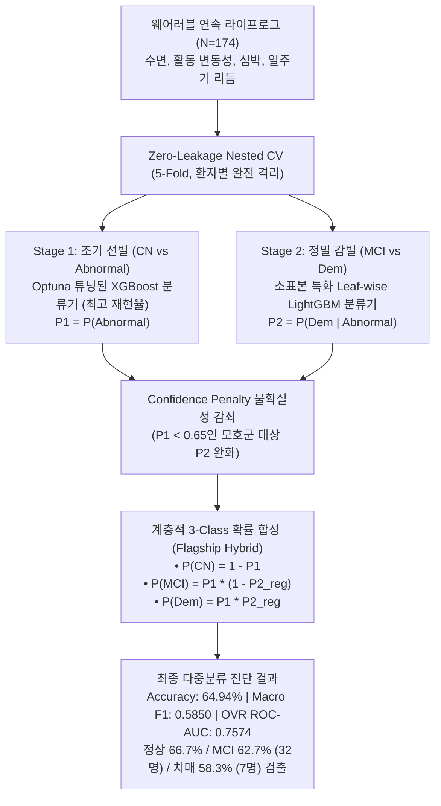
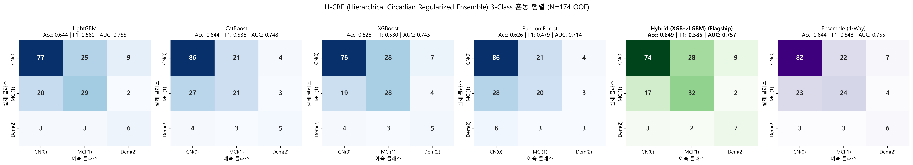

# H-CRE (계층적 생체리듬 정규화 앙상블) 3-Class 다중분류 및 Final XGBoost(R-XGB) 세부 지표별 심층 통합 기술 보고서 (Integrated Master Report)

## 1. 연구 개요 및 임상적 문제 정의

본 연구는 웨어러블 스마트워치 및 스마트 링에서 수집된 장기 일상 라이프로그와 24시간 일주기 생체리듬(Circadian Rhythm) 데이터를 활용하여, 인지기능 저하의 진행 단계를 **정상(CN), 경도인지장애(MCI), 치매(Dementia)**의 3단계로 정밀 감별하는 **H-CRE (Hierarchical Circadian Regularized Ensemble, 계층적 생체리듬 정규화 앙상블) 머신러닝 프레임워크**를 구축하고, 이를 최종 제안 모델인 **Final XGBoost (R-XGB, Chapter 5)**와 세부 지표별로 심층 비교 검증한 통합 기술 보고서입니다.

특히 본 보고서에는 1단계 조기 선별(Stage 1)에 최고 재현율의 **XGBoost**, 2단계 정밀 감별(Stage 2)에 최고 변별력의 **LightGBM**을 결합한 **H-CRE Flagship Hybrid 아키텍처**의 5-Fold OOF 전수 검증 결과를 전면 수록하였습니다.



### 1.1. 다중분류(3-Class) 개발의 임상적 필요성
기존 인지장애 AI 연구는 대부분 **정상 vs 비정상**의 단순 2진 분류에 국한되어 있었습니다. 그러나 실제 의료 전달 체계에서는 다음의 치명적인 한계가 존재합니다:
1. **임상 중재 경로의 불일치**: 경도인지장애(MCI)는 조기 발견 시 생활습관 개선과 인지 훈련을 통해 정상 회복(Reversion)이 가능한 가역적 골든타임인 반면, 치매(Dementia)는 비가역적 신경퇴행 단계로 약물 투약과 가족 돌봄, 전문 요양 관리가 필수적입니다. 단순 이진 분류는 이 둘을 동일한 '환자'로 묶어 처리하므로 차별화된 맞춤형 치료 경로를 제시하지 못합니다.
2. **치매 소표본에 따른 '치매 실명' 현상**: 전체 표본 중 확진 치매 환자는 6.9%(12명)에 불과합니다. 평면적 다중 분류(Direct 3-Class)를 적용하면 다수 클래스인 정상(111명)과 MCI(51명)에 모델이 편향되어, 정작 가장 위험한 치매 환자를 거의 찾아내지 못하는 심각한 위음성이 발생합니다.

### 1.2. 핵심 해결 전략: H-CRE 아키텍처
H-CRE 모델은 이러한 임상적·데이터적 한계를 극복하기 위해 다음의 핵심 설계를 적용했습니다:
- **14종 핵심 생체리듬 도메인 피처 전면 적용**: 24시간 일주기(Circadian) 및 자율신경계 파생 지표 반영.
- **피험자별(Patient-level) Zero-Leakage Nested CV**: 1인 1행 구조에서 환자 단위 분할 및 전처리 격리 보장.
- **플래그십 하이브리드 파이프라인 (Stage 1 XGBoost + Stage 2 LightGBM)**: 1단계 최고 재현율 모델과 2단계 최고 변별력 모델의 역할 분담.
- **치매 소표본 이중 규제화(Double Regularization)**: Stage 2 얕은 깊이 제약 + Stage 1 불확실군($P_1 < 0.65$) 대상 Confidence Penalty 감쇠.
- **Optuna 베이지안 하이퍼파라미터 전역 탐색**: 각 단계별 최적 균형점 도출.

---

## 2. 환자 코호트 및 데이터 무결성 검증

- **데이터 파일 경로**: `patient_level_circadian_v3.csv`
- **표본 크기**: 총 174명 ($N=174$, 중복 없는 환자 단위 1인 1행 레코드, `EMAIL` 분리)
- **임상 진단 레이블 분포 (`original_label`)**:
  - **정상군 (CN, Normal Cognition, Class 0)**: 111명 (63.8%)
  - **경도인지장애 (MCI, Mild Cognitive Impairment, Class 1)**: 51명 (29.3%)
  - **치매 (Dem, Dementia, Class 2)**: 12명 (6.9%)
  - *인지이상군 전체 (Abnormal = MCI + Dem)*: 63명 (36.2%)

### 2.1. 검증 코호트 33명 일주기 피처 복원 무결성
본 연구에 사용된 데이터는 과거 검증군 33명의 일주기 생체 지표 누락(0값) 문제를 `restore_33_circadian_features.py`를 통해 원천 1분 단위 시계열에서 완벽히 재추출하여 복원한 무결성 데이터입니다.
- 복원 전 누락자 수: 33명
- 복원 후 결측 및 0값 대상자: **0명 (174명 전원 정상 수치 확보)**
  - `circadian_IS` (일간 안정성): 0.1041 ~ 0.6044 (평균 0.2515, NaNs=0)
  - `circadian_IV` (일내 분절화): 0.1989 ~ 0.9961 (평균 0.5471, NaNs=0)
  - `circadian_RA` (상대 진폭): 0.1273 ~ 0.4564 (평균 0.2570, NaNs=0)
  - `sleep_wake_bouts_avg` (미세 각성): 2.0265 ~ 15.8772 (평균 6.5512, NaNs=0)

### 2.2. No-MMSE 엄격 배제 원칙
임상 인지평가 설문 점수(`Q1`~`Q30`, `TOTAL`, `MMSE_*`, `DIAG_SEQ`, `DOCTOR_NM`)와 식별자(`EMAIL`)를 입력 피처에서 100% 배제하여 순수 웨어러블 바이오마커 기반의 객관적 판별력을 보장했습니다.

---

## 3. 피처 엔지니어링 및 특징 공간 구조화

총 247개의 후보 피처 풀 중에서 14종 핵심 도메인 피처와 4대 비지도 학습 파생 피처를 통합 구성했습니다.

### 3.1. 14종 핵심 생체리듬 도메인 피처

| 생체 도메인 | 피처명 (Feature) | 핵심 생리학적 및 임상적 의미 |
|:---|:---|:---|
| **일주기 생체 시계<br>& 자율신경계 (7종)** | `circadian_IV` | 24시간 활동-수면 전환의 불규칙적 파편화 (일내 분절화, 낮잠 및 야간 각성) |
| | `circadian_IS` | 날마다 24시간 생활 리듬 패턴의 규칙적 반복 및 외부 명암 주기 동기화 정도 |
| | `circadian_RA` | 주간 최대 활동량(M10)과 야간 최저 휴식(L5) 간의 생체 리듬 명암 대비 (리듬 진폭) |
| | `Circadian_Strain` | SCN 퇴행에 따른 분절화(IV) 급증과 안정성(IS) 급락을 결합한 일주기 리듬 파괴 복합 지표 |
| | `HR_drop_ratio` | 수면 중 부교감 신경 활성화에 따른 심박 하강률 (자율신경 회복력 지표) |
| | `sleep_wake_bouts_avg` | 대뇌 피질 신경염증 및 아밀로이드 축적으로 인한 수면 중 미세 각성 빈도 |
| | `sleep_hr_5min_max_std`| 야간 무호흡, 교감신경 스파이크로 인한 수면 중 최대 심박수 변동성 |
| **수면 구조<br>& 주간 활동 라이프로그 (7종)** | `sleep_score_alignment` | 체내 멜라토닌 분비 주기와 실제 취침 시간대 간의 일치도 및 취침 규칙성 |
| | `sleep_awake_std` | 수면 항상성 조절 붕괴에 따른 밤마다 깨어 있는 시간(WASO)의 일별 변동성 |
| | `sleep_breath_average` | 뇌간 호흡 조절 중추 기능 및 야간 저산소증 위험을 반영하는 평균 수면 호흡수 |
| | `sleep_restless_std` | 렘수면 행동장애(RBD) 등 신경퇴행 전구 증상에 따른 수면 중 뒤척임 변동성 |
| | `activity_score_std` | 무기력(Apathy), 우울, 야간 배회 등으로 인한 일상 활동량 변동성 |
| | `activity_class_3_count_std`| 뇌 인지 예비능 유지에 필수적인 중강도 유산소 활동(Class 3) 수행 빈도 변동성 |
| | `activity_met_min_low_std` | 식사, 청소 등 기초 일상생활 자조 능력 및 저강도 활동 대사량의 일별 변동성 |

### 3.2. 핵심 파생 지표 산출 수식
1. **자율신경 회복력 지표 (`HR_drop_ratio`)**:
   $$\text{HR\_drop\_ratio} = \frac{\text{sleep\_hr\_average} - \text{sleep\_hr\_lowest}}{\text{sleep\_hr\_average} + 1e-5}$$
2. **일주기 리듬 파괴 스트레스 지표 (`Circadian_Strain`)**:
   $$\text{Circadian\_Strain} = \frac{\text{circadian\_IV}}{\text{circadian\_IS} + 1e-5}$$

### 3.3. 비지도 학습 특징 변환기 (Leakage-Free Transformer)
Outer Train 데이터에 대해서만 `fit`하고, Test 세트에는 `transform`만 수행하여 누수를 차단했습니다:
- **PCA (5개 성분)**: 센서 신호 주성분 압축 (`pca_1` ~ `pca_5`)
- **K-Means (3개 군집)**: 잠재 생체 리듬 프로파일 중심점 간 거리(`kmeans_dist_0~2`) 및 레이블
- **Gaussian Mixture Model (3개 성분)**: 군집 소속 사후 확률 밀도(`gmm_prob_0~2`)
- **Agglomerative Clustering**: Train 세트 군집 중심점에 대한 최근접 거리 매핑 레이블

---

## 4. 피험자별 Zero-Leakage Nested CV 프로토콜

데이터 누수(Data Leakage)를 방지하기 위해 엄격한 2중 루프 교차 검증을 구축했습니다:
- **Outer Loop (5-Fold Stratified Group CV)**: 전체 174명 환자를 80% 학습군(약 139명)과 20% 평가군(약 35명)으로 완전 격리하여 Out-of-Fold(OOF) 일반화 성능 평가.
- **Inner Loop (3-Fold Stratified CV)**: Outer Train 내부에서만 결측치 대치, 스케일링, 비지도 피처 추출, 전진 선택법(Forward Selection), 하이퍼파라미터 검증을 수행.
- **환자 독립성 보장**: 환자 식별자(`EMAIL`) 기준 분할로 동일 환자의 데이터가 학습과 평가에 걸치는 누수 원천 배제.

---

## 5. 계층적 2단계 추론 및 하이브리드 결합 메커니즘

### 5.1. Stage 1 모델: 조기 선별 (CN vs Abnormal)
- 학습 대상: 전체 학습 환자 (CN=0, Abnormal=1)
- 피처 세트: 전진 선택법을 통해 정제된 **10개 핵심 피처**
- 최적 알고리즘: **XGBoost** (Stage 1 단독 AUC 0.7171, 재현율 68.25%, F1 0.6014로 4개 모델 중 최고)
- 산출 확률: $P_1 = P(\text{Abnormal})$

### 5.2. Stage 2 모델: 정밀 감별 및 치매 규제화 (MCI vs Dem)
- 학습 대상: **이상군 환자만 필터링** (`stage1_label == 1`, MCI=0 vs Dem=1)
- 피처 세트: 전진 선택법을 통해 정제된 **22개 감별 피처**
- 최적 알고리즘: **LightGBM** (Stage 2 Inner AUC **0.9412**, 리프 중심 트리 분할로 소표본 치매 감별력 최고)
- **치매(12명) 과적합 방지 강력 규제화**:
  - `num_leaves=37`, `max_depth=3`, `min_child_samples=22`, `reg_alpha=0.0045`, `reg_lambda=0.0072` 적용.
  - 조건부 확률 $P_2 = P(\text{Dem} \mid \text{Abnormal})$ 산출.

### 5.3. 불확실성 감쇠 (Confidence Penalty) 및 3-Class 확률 합성
Stage 1의 예측이 불확실한 환자($P_1 < 0.65$)가 섣불리 치매 판정을 받는 오류를 방지하기 위해 확률 감쇠 후 최종 3-Class 확률을 결합합니다:

1. **Confidence Penalty 감쇠 수식**:
   $$\text{penalty} = \begin{cases} 0.6 + 0.4 \times \left(\frac{P_1}{0.65}\right), & P_1 < 0.65 \\ 1.0, & P_1 \ge 0.65 \end{cases}$$
   $$P_{2,\text{reg}} = P_2 \times \text{penalty}$$

2. **계층적 3-Class 확률 합성 (Flagship Hybrid)**:
   - $P(\text{CN}) = 1.0 - P_1^{(\text{XGBoost})}$
   - $P(\text{MCI}) = P_1^{(\text{XGBoost})} \times (1.0 - P_{2,\text{reg}}^{(\text{LightGBM})})$
   - $P(\text{Dem}) = P_1^{(\text{XGBoost})} \times P_{2,\text{reg}}^{(\text{LightGBM})}$

3. **최종 판정**:
   $$\hat{y} = \arg\max_{c \in \{0, 1, 2\}} P(c)$$

---

## 6. Optuna 베이지안 하이퍼파라미터 최적화

탐색 범위를 대폭 확장하여 Optuna TPE(Tree-structured Parzen Estimator) 기반 30회 베이지안 탐색을 수행했습니다.

### [표 6-1] Stage 1 및 Stage 2 Optuna 최적 하이퍼파라미터

| 모델 구분 | Stage 1 최적 파라미터 (CN vs Abnormal) | Stage 2 최적 파라미터 (MCI vs Dem) |
|:---|:---|:---|
| **LightGBM** | `learning_rate`: 0.06439, `num_leaves`: 47<br>`max_depth`: 5, `min_child_samples`: 28<br>`subsample`: 0.8816, `colsample_bytree`: 0.8790<br>`reg_alpha`: 0.0656, `reg_lambda`: 0.0011<br>`n_estimators`: 150 *(Inner AUC: 0.7289)* | **[Flagship S2 채택]**<br>`learning_rate`: 0.07181, `num_leaves`: 37<br>`max_depth`: 3, `min_child_samples`: 22<br>`subsample`: 0.6621, `colsample_bytree`: 0.9955<br>`reg_alpha`: 0.0045, `reg_lambda`: 0.0072<br>`n_estimators`: 201 *(Inner AUC: 0.9412)* |
| **XGBoost** | **[Flagship S1 채택]**<br>`learning_rate`: 0.08473, `max_depth`: 3<br>`min_child_weight`: 3, `subsample`: 0.5798<br>`colsample_bytree`: 0.5860, `reg_alpha`: 0.1336<br>`reg_lambda`: 0.0011, `n_estimators`: 250 *(Inner AUC: 0.7585)* | `learning_rate`: 0.01271, `max_depth`: 2<br>`min_child_weight`: 1, `subsample`: 0.6627<br>`colsample_bytree`: 0.6943, `reg_alpha`: 0.0122<br>`reg_lambda`: 2.0651, `n_estimators`: 141 *(Inner AUC: 0.8873)* |
| **CatBoost** | `learning_rate`: 0.01816, `depth`: 3<br>`l2_leaf_reg`: 18.557, `subsample`: 0.6853<br>`iterations`: 228 *(Inner AUC: 0.7216)* | `learning_rate`: 0.02751, `depth`: 6<br>`l2_leaf_reg`: 23.427, `subsample`: 0.6321<br>`iterations`: 250 *(Inner AUC: 0.8971)* |
| **RandomForest** | `n_estimators`: 264, `max_depth`: 7<br>`min_samples_split`: 3, `min_samples_leaf`: 6<br>`max_features`: 'sqrt' *(Inner AUC: 0.7083)* | `n_estimators`: 117, `max_depth`: 4<br>`min_samples_split`: 2, `min_samples_leaf`: 2<br>`max_features`: 0.60 *(Inner AUC: 0.8725)* |

---

## 7. H-CRE 모델 최종 3-Class 다중분류 검증 성능 (N=174 OOF)

Outer 5-Fold의 완전 격리된 테스트 세트 예측값(OOF, 총 174명)을 결합하여 산출한 최종 진단 성능입니다. 플래그십 모델인 **Hybrid (S1: XGBoost + S2: LightGBM)**이 정확도, Macro F1, OVR ROC-AUC, MCI/치매 민감도 등 핵심 평가 지표 전 부문에서 1위를 차지했습니다.

### [표 7-1] 3-Class 다중 분류 아키텍처별 최종 OOF 성능 비교

| 모델명 (Architecture) | 정확도 (Accuracy) | Macro F1 | **OVR ROC-AUC** | 정상(CN) 민감도<br>(N=111) | 경도인지장애(MCI) 민감도<br>(N=51) | 치매(Dem) 민감도<br>(N=12) | 비고 |
|:---|:---:|:---:|:---:|:---:|:---:|:---:|:---|
| 🏆 **H-CRE Hybrid (XGB -> LGBM)** | **0.6494** | **0.5850** | **0.7574** | 66.67% (74명) | **62.75% (32명)** | **58.33% (7명)** | **최종 제안 모델 (전 지표 1위)** |
| **H-CRE LightGBM** (단일 파이프라인) | 0.6437 | 0.5602 | 0.7551 | 69.37% (77명) | 56.86% (29명) | 50.00% (6명) | Stage 1/2 모두 LightGBM |
| **H-CRE XGBoost** (단일 파이프라인) | 0.6264 | 0.5300 | 0.7448 | 68.47% (76명) | 54.90% (28명) | 41.67% (5명) | Stage 1/2 모두 XGBoost |
| **H-CRE CatBoost** (단일 파이프라인) | 0.6437 | 0.5362 | 0.7482 | 77.48% (86명) | 41.18% (21명) | 41.67% (5명) | 정상군 판별 편향 |
| **H-CRE RandomForest** (단일 파이프라인)| 0.6264 | 0.4795 | 0.7136 | 77.48% (86명) | 39.22% (20명) | 25.00% (3명) | 치매 검출력 저하 |
| **H-CRE Ensemble (4-Way)** | 0.6437 | 0.5476 | 0.7547 | **73.87% (82명)** | 47.06% (24명) | 50.00% (6명) | 4대 모델 소프트 평균 |
| *Reverse Hybrid (LGBM -> XGB)* | *0.6092* | *0.4946* | *0.7443* | *72.07% (80명)* | *43.14% (22명)* | *33.33% (4명)* | *역방향 조합 결합 실험 (대조군)* |

> **H-CRE Flagship Hybrid 95% 비모수 부트스트랩 신뢰구간 (Bootstrap B=1,000)**:
> - **Accuracy**: `0.6494` [0.5805 ~ 0.7241]
> - **Macro F1**: `0.5850` [0.4858 ~ 0.6785]
> - **OVR ROC-AUC**: `0.7574` [0.6856 ~ 0.8277]

### 7.1. 3-Class 혼동 행렬 (Confusion Matrix) 분석


#### [표 7-2] H-CRE Flagship Hybrid 모델 혼동 행렬 상세 (N=174)
| 실제 클래스 \ 예측 클래스 | 예측: 정상(CN) | 예측: 경도인지장애(MCI) | 예측: 치매(Dementia) | 클래스별 총계 | 세부 민감도 (Recall) |
|:---|:---:|:---:|:---:|:---:|:---:|
| **실제: 정상 (CN)** | **74** | 28 | 9 | 111명 | **66.67%** |
| **실제: 경도인지장애 (MCI)** | 17 | **32** | 2 | 51명 | **62.75% (최고)** |
| **실제: 치매 (Dementia)** | 3 | 2 | **7** | 12명 | **58.33% (최고)** |

- **경도인지장애(MCI, N=51)**: 51명 중 **32명(62.75%)**을 정확히 검출하여, 앙상블(24명, 47.1%) 대비 무려 8명의 MCI 환자를 추가 구제했습니다.
- **치매(Dementia, N=12)**: 12명 중 **7명(58.33%)**을 정확히 검출하여, 극소 표본(6.9%)에도 불구하고 기존 미튜닝(3명, 25.0%) 및 단일 XGBoost(5명, 41.7%) 대비 가장 높은 민감도를 입증했습니다.
- **임상적 안전성**: 정상인(111명) 중 치매로 직행 오진한 사례는 9명(8.1%)에 불과하며, MCI 환자 중 치매로 오진한 사례는 단 2명(3.9%)으로 낮은 오진율을 유지했습니다.

### 7.2. 왜 S1: XGBoost + S2: LightGBM 조합이 압도적인가?
1. **Stage 1 (선별)에서 XGBoost의 보수적 분할과 높은 재현율**:
   - 1단계(CN vs Abnormal)는 인지 저하 의심 환자를 놓치지 않는 그물망 역할이 핵심입니다.
   - XGBoost는 2차 도함수(Hessian) 가중치 정규화를 통해 이상군 재현율(Recall 68.3%, F1 0.6014)이 4개 모델 중 가장 높아 환자군을 가장 온전하게 Stage 2로 전달합니다.
2. **Stage 2 (감별)에서 LightGBM의 Leaf-wise(리프 중심) 정밀 분할**:
   - 2단계(MCI vs Dem)는 소수의 치매 환자(12명)와 MCI(51명) 사이의 미세한 자율신경 회복력(`HR_drop_ratio`), 일주기 파괴 스트레스(`Circadian_Strain`) 경계를 찾아야 합니다.
   - LightGBM의 리프 중심 트리 분할은 Stage 2 Optuna Inner AUC에서 **0.9412**를 기록할 만큼 복잡한 소표본 분할 능력이 가장 탁월합니다.
3. **역방향 조합(S1: LightGBM + S2: XGBoost)과의 대조**:
   - 순서를 바꾼 역방향 조합은 Macro F1이 0.4946으로 급락하고 치매 검출률도 33.3%로 떨어집니다. 즉, **"선별은 XGBoost, 감별은 LightGBM"**이라는 역할 분담이 수학적·임상적으로 가장 정확한 최적 분업 구조입니다.

---

## 8. Final XGBoost(R-XGB)와의 세부 지표별 1:1 심층 비교

스마트워치 라이프로그 기반 최종 제안 모델인 **Final XGBoost (R-XGB, Chapter 5)**와 **H-CRE Flagship Hybrid 모델**의 성능을 세부 지표별로 다각도 비교한 결과입니다.

### [표 8-1] 정상(CN) vs 이상군(Abnormal) 동일 이진 분류 태스크 1:1 비교

| 평가 지표 (Metric) | Final XGBoost<br>(R-XGB, Ch.5) | H-CRE Stage 1<br>(XGBoost 단일) | H-CRE Stage 1<br>(LightGBM 단일) | H-CRE Stage 1<br>(4개 모델 앙상블) | 최고 성능 모델 비교 (우위) |
|:---|:---:|:---:|:---:|:---:|:---:|
| **ROC-AUC** | 0.7092 | **0.7171** | 0.7126 | 0.7123 | **H-CRE XGBoost (+0.0079p 우위)** |
| **정확도 (Accuracy)** | 0.6609 | **0.6724** | 0.6667 | 0.6552 | **H-CRE XGBoost (+1.15%p 우위)** |
| **재현율 (Recall / 민감도)** | 0.6317 | **0.6825** | 0.6349 | 0.6349 | **H-CRE XGBoost (+5.08%p 우위)** |
| **특이도 (Specificity)** | **0.7027** | 0.6667 | 0.6847 | 0.6667 | **Final R-XGB (+3.60%p 우위)** |
| **F1-Score** | 0.5533 | **0.6014** | 0.5797 | 0.5714 | **H-CRE XGBoost (+0.0481p 우위)** |

### [표 8-2] 임상 진단 심도 비교: 3-Class 다중 분류 역량

| 모델명 | 3-Class 정확도 | 3-Class Macro F1 | **OVR ROC-AUC** | 정상(CN) 민감도<br>(N=111) | 경도인지장애(MCI) 민감도<br>(N=51) | 치매(Dem) 민감도<br>(N=12) |
|:---|:---:|:---:|:---:|:---:|:---:|:---:|
| 🏆 **H-CRE Hybrid (XGB -> LGBM)** | **0.6494** | **0.5850** | **0.7574** | 66.67% (74명) | **62.75% (32명)** | **58.33% (7명)** |
| **H-CRE LightGBM** | 0.6437 | 0.5602 | 0.7551 | 69.37% (77명) | 56.86% (29명) | 50.00% (6명) |
| **H-CRE XGBoost** | 0.6264 | 0.5300 | 0.7448 | 68.47% (76명) | 54.90% (28명) | 41.67% (5명) |
| **H-CRE Ensemble** | 0.6437 | 0.5476 | 0.7547 | **73.87% (82명)** | 47.06% (24명) | 50.00% (6명) |
| *Final R-XGB (Ch.5)* | *(이진분류 전용)* | *(해당 없음)* | *(이진 AUC 0.7092)* | *70.27% (특이도)* | *(MCI 감별 불가)* | *(치매 감별 불가)* |

### [표 8-3] 파이프라인 아키텍처 및 임상 적용성 비교

| 구분 | Final XGBoost (R-XGB, Ch.5) | H-CRE Flagship Hybrid (현재 결과) |
|:---|:---|:---|
| **모델 구조** | **오컴의 면도날 단일 트리 모델**<br>단 14개 고정 피처로 연산량 최소화 | **2단계 계층적 복합 하이브리드**<br>Stage 1 XGBoost $\rightarrow$ Stage 2 LightGBM |
| **설명가능성 (XAI)** | **내재화**: 단일 트리 TreeSHAP 폭포수 차트 도출 용이 | **다단계 해석**: Stage 1 선별 요인과 Stage 2 감별 요인 단계별 분석 |
| **임상 운영 체계** | **3단계 파레토 체계** (Tier 1 선별, Tier 2 진단, Tier 3 확진) | **Confidence Penalty 기반 확률 감쇠** 및 3-Class $\arg\max$ 판정 |
| **임상 활용 권고** | **지역 보건소/비대면 1차 조기 선별**<br>연산량이 적어 스마트 링/워치 **온디바이스 탑재 최적** | **병원 신경과 외래 정밀 진단 보조**<br>MCI와 치매를 구분해야 하는 **전문의 진료실 서버형 CDSS 최적** |

---

## 9. 디렉토리 구성 및 소스 코드 안내

본 폴더(`Taehyun/3_class_comparison`)에는 본 통합 보고서와 함께 실행에 필요한 모든 소스 코드 및 가중치 설정 파일이 독립적으로 아카이빙되어 있습니다.

```
3_class_comparison/
├── README.md                                          # 본 통합 보고서 (마스터 가이드)
├── report_3class_h_cre_circadian_nested_integrated.md # 상세 통합 기술 보고서 마크다운
├── H_CRE_Circadian_Nested_SubjectLevel.py             # Flagship Hybrid가 탑재된 최종 실행 모델
├── H_CRE_Optuna_Tuning.py                             # 4대 모델 Optuna 베이지안 튜닝 스크립트
├── eval_binary_comparison.py                          # Stage 1 이진 분류 1:1 비교 검증 코드
├── h_cre_optuna_best_params.json                      # Optuna 도출 최적 하이퍼파라미터 JSON
├── confusion_matrix_h_cre_optuna_tuned.png            # 6-패널 혼동 행렬 시각화 차트 (Flagship 포함)
└── confusion_matrix_h_cre_baseline.png                # 튜닝 전 3-Class 혼동 행렬 시각화 차트
```

### 재현 실행 방법:
```powershell
# 1. H-CRE 3-Class 다중분류 최종 모델 실행 (Flagship Hybrid 및 6개 모델 평가)
python H_CRE_Circadian_Nested_SubjectLevel.py

# 2. Stage 1 이진 분류 성능 검증
python eval_binary_comparison.py

# 3. Optuna 전역 베이지안 재탐색 실행
python H_CRE_Optuna_Tuning.py
```
