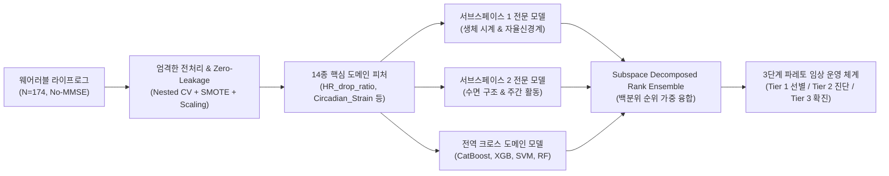
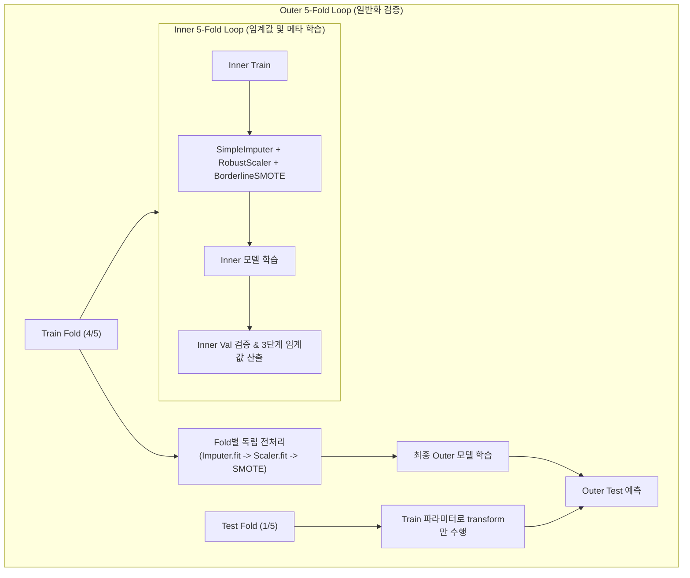
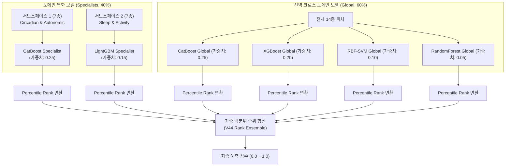
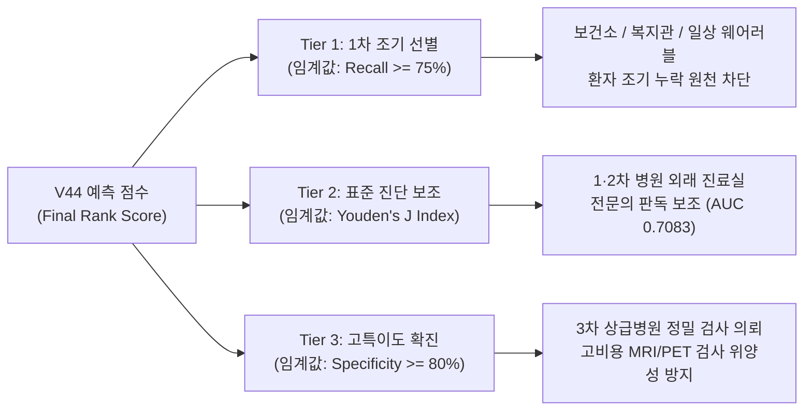

# V44 Circadian Subspace SOTA 모델 완벽 해설서

본 문서는 **일주기 생체 리듬(Circadian Rhythm)** 및 **웨어러블 라이프로그(Wearable Lifelog)** 데이터를 활용하여 인지기능 저하(경도인지장애 및 치매)를 조기에 선별하는 **V44 Circadian Subspace SOTA(State-Of-The-Art)** 모델의 전체 파이프라인을 처음 접하는 연구자, 개발자, 임상의가 쉽게 이해할 수 있도록 상세히 설명한 기술 가이드입니다.

---

## 1. 연구 배경 및 문제 정의

### 1.1 치매 조기 선별의 임상적 한계
전통적인 치매 선별은 주로 병원이나 보건소에 직접 방문하여 실시하는 문답식 간이 정신상태 검사(MMSE, Mini-Mental State Examination)에 크게 의존해 왔습니다. 그러나 이러한 설문 기반 검사는 다음과 같은 뚜렷한 한계를 가집니다.
1. **일회성 측정의 왜곡**: 환자의 당일 신체 컨디션, 수면 부족, 우울감, 또는 검사자에 대한 긴장도에 따라 점수 편차가 크게 발생합니다.
2. **학습 효과(Practice Effect)**: 검사를 반복해서 받을 경우 문항을 외워 실제 인지 저하가 있음에도 정상 점수를 기록하는 위음성(False Negative)이 발생합니다.
3. **지속적 모니터링의 부재**: 환자가 병원을 찾기 전까지는 일상생활 속에서 서서히 진행되는 뇌신경계 퇴행을 조기에 감지하기 어렵습니다.

### 1.2 No-MMSE 환경: 순수 생체 신호 기반 스크리닝
본 연구의 궁극적인 목표는 **설문 기반 인지 점수(MMSE)를 완전히 배제(No-MMSE)**한 상태에서, 환자가 일상에서 착용하는 스마트 링(Oura Ring) 등의 웨어러블 기기에서 수집된 **순수 24시간 생체 신호 및 라이프로그만으로** 경도인지장애(MCI)와 치매(Dementia)를 정상 노인군(CN)과 구별해 내는 것입니다.

### 1.3 핵심 도전 과제: 소규모 데이터와 노이즈
의료 데이터의 특성상 전체 환자 표본($N=174$)이 제한적이며, 일주기 리듬, 수면 구조, 주간 활동, 자율신경계 반응 등 서로 다른 생리학적 메커니즘을 가진 피처들이 혼재되어 있습니다. 이를 단일 딥러닝이나 단순 머신러닝 모델에 한꺼번에 입력하면 피처 간 노이즈 간섭과 과적합(Overfitting)이 발생하여 일반화 성능이 저하됩니다.

V44 모델은 이를 극복하기 위해 **도메인 특화 서브스페이스 분해(Feature-Subspace Decomposition)**와 **백분위 순위 기반 앙상블(Rank Ensemble)**, 그리고 **3단계 파레토 임상 운영 체계(3-Tier Clinical Operating System)**를 도입하여 엄격한 이중 교차 검증(Nested CV) 기준 **ROC-AUC 0.7083**의 최고 성능을 달성했습니다.

---

## 2. 데이터셋 구성 및 타깃 정의

### 2.1 데이터셋 사양
- **분석 단위**: 중복 없는 환자 단위 레코드 (Patient-Level Tabular Dataset)
- **표본 수**: 총 174명 ($N=174$)
- **데이터 소스**: 스마트 링(Oura Ring) 기반 24시간 라이프로그를 1인당 장기간 수집하여 요약한 환자별 집계 데이터 (`patient_level_circadian_v3.csv`)

### 2.2 분류 타깃 (Binary Classification)
- **정상군 (Class 0, CN: Cognitively Normal)**: 111명 (63.8%)
- **인지저하 환자군 (Class 1, CI: Cognitive Impairment)**: 63명 (36.2%)
  - 경도인지장애(MCI) 51명 + 알츠하이머병 치매(Dementia) 12명
- 본 태스크는 인지기능 저하의 조기 발견이 핵심이므로, MCI와 Dementia를 포괄한 인지저하 환자군 전체를 조기에 탐지하는 이진 분류로 구성되었습니다.

### 2.3 데이터 누수 차단 및 No-MMSE 원칙
환자의 라벨을 직접적으로 암시할 수 있는 모든 설문 문항 점수(`Q1`~`Q30`), MMSE 총점(`TOTAL`), 검사 회차(`DIAG_SEQ`), 담당 의사 정보(`DOCTOR_NM`), 환자 식별자(`EMAIL`, `SAMPLE_EMAIL`) 등 총 11개 컬럼을 모델 학습 입력에서 원천 배제했습니다.

---

## 3. 데이터 전처리 파이프라인 (Data Preprocessing)

의료 머신러닝 연구에서 가장 흔히 발생하는 치명적인 오류는 데이터 누수(Data Leakage)입니다. 전체 데이터셋을 대상으로 스케일러나 결측치 대치기를 먼저 학습시킨 뒤 교차 검증을 수행하면, 테스트 데이터의 통계량이 학습 과정에 흘러들어가 모델의 성능이 비현실적으로 과대평가됩니다.

V44 모델은 이러한 누수를 100% 방지하기 위해 모든 전처리 과정을 교차 검증 Fold 내부에서 격리 실행하도록 설계했습니다.

### 3.1 Zero-Leakage Nested Cross-Validation 구조
- **Outer Cross-Validation (5-Fold)**:
  - 모델의 최종 일반화 성능(Out-of-Fold, OOF)을 엄격하게 평가하기 위한 외부 검증 루프입니다.
  - 환자 식별자 중복이 없는 단일 환자 레코드 환경에서 라벨 비율(CN: 63.8%, CI: 36.2%)을 균등하게 분할하는 `StratifiedKFold`를 적용했습니다.
- **Inner Cross-Validation (5-Fold)**:
  - Outer Train 데이터 내부에서 다시 5-Fold로 분할하여, 테스트 세트를 보지 않고 모델별 예측 확률을 생성합니다.
  - 이 예측 확률을 바탕으로 의료 현장에 적용할 3단계 임상 임계값(Thresholds)을 계산하고 메타 학습기를 훈련합니다.

### 3.2 단계별 전처리 세부 내역

#### 1단계: 결측치 대치 (Median Imputation)
- **적용 기법**: `SimpleImputer(strategy='median')`
- **적용 이유**: 웨어러블 센서의 특성상 착용 상태나 배터리 방전 등으로 일부 피처에 결측(NaN)이 존재할 수 있습니다. 평균(Mean)은 극단값에 취약하므로, 생체 신호의 비대칭 분포에서도 안정적인 중앙값(Median)으로 대치했습니다.
- **격리 원칙**: Train 세트의 중앙값만을 산출(`fit`)한 뒤, Test 세트는 해당 중앙값으로 단순 대치(`transform`)만 수행합니다.

#### 2단계: 로버스트 정규화 (Robust Scaling)
- **적용 기법**: `RobustScaler()`
- **적용 이유**: 표준 정규화(StandardScaler)나 최소-최대 정규화(MinMaxScaler)는 심박수 급등, 야간 뒤척임 극단치 등 생체 센서의 이상치(Outlier)가 존재할 경우 평균과 분산이 심하게 왜곡됩니다. `RobustScaler`는 사분위수 범위(IQR: 25th ~ 75th percentile)를 기준으로 스케일링하므로 이상치 왜곡에 극도로 강건합니다.
- **격리 원칙**: Test 세트의 스케일링은 Train 세트에서 계산된 사분위수 기준을 그대로 적용합니다.

#### 3단계: 경계면 중심 오버샘플링 (Borderline-SMOTE)
- **적용 기법**: `BorderlineSMOTE(random_state=42)`
- **적용 이유**: 데이터셋 내 환자군 비율(36.2%)이 정상군(63.8%)보다 적어 모델이 정상군 쪽으로 편향될 위험이 있습니다. 단순 SMOTE는 모든 영역에서 무작위로 합성하여 노이즈를 증가시키는 반면, Borderline-SMOTE는 정상군과 인지저하군의 결정 경계(Decision Boundary)에 위치한 어려운 샘플들 주변에 가상 샘플을 집중 생성함으로써 분류 경계면을 정교하게 다듬습니다.
- **치명적 누수 방지 원칙**: 오버샘플링은 **반드시 각 Fold의 Train 세트에만 적용**됩니다. Test 세트에는 절대 적용되지 않으므로 실제 환자 평가 시의 데이터 무결성이 완벽히 보장됩니다.

---

## 4. 피처 엔지니어링 및 도메인 서브스페이스 분해

본 연구는 맹목적으로 피처 수를 늘리는 대신, 인지기능 저하와 직접적으로 연관된 생리학적 기전을 반영하여 **14종의 핵심 도메인 피처**를 엄선했습니다.

### 4.1 핵심 파생 지표 (Engineered Domain Biomarkers)

기존 원천 데이터(Raw Data)의 단일 지표 한계를 극복하기 위해, 최신 신경과학 및 일주기 생체리듬 의학 문헌을 기반으로 2종의 핵심 파생 피처를 새로 설계했습니다.

#### 1. 자율신경 회복력 지표 (`HR_drop_ratio`)
- **수학적 정의**:
  $$\text{HR\_drop\_ratio} = \frac{\text{sleep\_hr\_average} - \text{sleep\_hr\_lowest}}{\text{sleep\_hr\_average} + \epsilon}$$
- **생리학적 의미**:
  - 건강한 성인은 수면 중 부교감 신경계가 활성화되면서 심박수가 주간 및 입면 초기보다 현저히 떨어지는 심박 하강 현상(Nocturnal Dipping)이 일어납니다.
  - 알츠하이머병 및 신경퇴행성 질환 초기 환자는 자율신경계 조절 기능이 손상되어 야간 심박 하강이 둔화(Non-dipping)되는 경향을 보입니다.
  - `HR_drop_ratio`는 수면 중 평균 심박수 대비 최저 심박수의 상대적 낙폭을 정량화하여 환자의 야간 자율신경 회복력을 직접 반영합니다.

#### 2. 일주기 리듬 파괴 스트레스 지표 (`Circadian_Strain`)
- **수학적 정의**:
  $$\text{Circadian\_Strain} = \frac{\text{circadian\_IV}}{\text{circadian\_IS} + \epsilon}$$
- **생리학적 의미**:
  - `circadian_IV` (Intradaily Variability, 일내 분절화): 하루 24시간 동안 활동과 휴식이 얼마나 잘게 쪼개져 있는지를 측정합니다. 인지저하 환자는 낮 동안 자주 졸고 밤에 자주 깨므로 IV 지수가 크게 증가합니다.
  - `circadian_IS` (Interdaily Stability, 일간 안정성): 날마다 일정한 24시간 리듬 패턴을 유지하는지 측정합니다. 규칙적인 생활 리듬이 무너질수록 IS 지수는 감소합니다.
  - `Circadian_Strain`은 분절화(IV)를 안정성(IS)으로 나눈 복합 비율 지표로, 뇌의 시상하부 시교차상핵(SCN, 생체 시계 조절 중추)의 퇴행성 리듬 붕괴 정도를 단일 수치로 극대화하여 표현합니다.

---

### 4.2 도메인 특화 서브스페이스 분해 (Subspace Decomposition)

14개의 피처를 하나의 모델에 몰아넣고 학습시키면, 서로 다른 생체 기전 간의 간섭으로 인해 트리 모델이 중요한 신호를 놓치기 쉽습니다. 따라서 생리학적 작용 기전(Mechanism of Action)에 따라 2개의 전문 서브스페이스와 1개의 전역 상호작용 세트로 분해했습니다.

| 구분 | 피처 수 | 소속 피처 목록 | 생체 신호 및 임상적 의미 |
|:---|:---:|:---|:---|
| **서브스페이스 1** (일주기 & 자율신경계) | 7종 | `circadian_IV` `circadian_IS` `circadian_RA` `sleep_wake_bouts_avg` `HR_drop_ratio` `Circadian_Strain` `sleep_hr_5min_max_std` | 24시간 생체 리듬의 일내 분절화, 일간 안정성, 활동 진폭(RA), 야간 미세 각성 빈도, 수면 중 자율신경계 회복력 및 최대 심박수 변동성을 반영하는 **생체 시계 및 신경계 조절 특화 영역** |
| **서브스페이스 2** (수면 구조 & 주간 활동) | 7종 | `sleep_score_alignment` `sleep_awake_std` `sleep_breath_average` `activity_score_std` `activity_class_3_count_std` `activity_met_min_low_std` `sleep_restless_std` | 입면 시간대의 일관성(Alignment), 수면 중 깬 시간의 변동성, 평균 수면 호흡수, 뒤척임 변동성, 주간 중강도/저강도 활동량 및 활동 점수의 일별 변동성을 반영하는 **일상 라이프로그 및 수면 구조 특화 영역** |
| **전역 통합 피처 세트** (Cross-Domain All) | 14종 | 위 서브스페이스 1, 2의 14종 전체 피처 | 개별 서브스페이스의 경계를 넘어 생체 시계와 수면-활동 간의 비선형 상호작용을 포착하기 위한 **전역 피처 세트** |

---

## 5. 모델 아키텍처 및 앙상블 기법 (Models & Methodology)

V44 아키텍처는 개별 도메인에 특화된 2개의 전문 모델(Specialists)과 전체 도메인을 폭넓게 탐색하는 4개의 전역 모델(Global Models)을 상호 보완적으로 배치했습니다.

### 5.1 도메인 특화 모델 (Domain Specialists)
1. **CatBoost Circadian Specialist**
   - **입력 피처**: 서브스페이스 1 (7종)
   - **알고리즘 특성**: CatBoost는 대칭 트리(Symmetric Trees) 구조를 사용하여 과적합 억제력이 매우 우수하며, 수치형 생체 시계 지표 간의 미세한 임계값을 안정적으로 학습합니다.
   - **하이퍼파라미터**: `depth=3`, `l2_leaf_reg=6.0`, `learning_rate=0.04`, `iterations=130`, `auto_class_weights='Balanced'`
2. **LightGBM Sleep Specialist**
   - **입력 피처**: 서브스페이스 2 (7종)
   - **알고리즘 특성**: Leaf-wise 분할 방식을 적용하여 수면 뒤척임, 활동량 변동성 등 복잡한 다봉형(Multimodal) 분포를 가진 라이프로그 피처를 신속하고 민감하게 포착합니다.
   - **하이퍼파라미터**: `max_depth=3`, `num_leaves=7`, `learning_rate=0.04`, `n_estimators=110`, `reg_alpha=0.2`, `reg_lambda=0.2`, `min_child_samples=18`, `class_weight='balanced'`

### 5.2 전역 크로스 도메인 모델 (Global Models)
14종 전체 피처를 사용하여 이종 알고리즘의 장점을 융합했습니다.
- **CatBoost Global**: `depth=3`, `l2_leaf_reg=4.0`, `learning_rate=0.035`, `iterations=140`
- **XGBoost Global**: `max_depth=3`, `learning_rate=0.04`, `n_estimators=100`, `subsample=0.8`, `colsample_bytree=0.8`
- **RBF SVM Global**: `C=1.0`, `kernel='rbf'`, 비선형 투영 공간에서 거리 기반 결정 경계 형성
- **RandomForest Global**: `max_depth=3`, `n_estimators=180`, 배깅(Bagging)을 통한 앙상블 분산 감소

---

### 5.3 핵심 앙상블 기법: Subspace Decomposed Rank Ensemble

단순히 모델들의 예측 확률을 평균(Soft Voting)내거나, 메타 로지스틱 회귀로 Stacking 학습을 시키면 다음과 같은 문제가 발생합니다.
- **모델 간 캘리브레이션 편차**: 트리 모델(XGBoost, CatBoost)과 SVM, RandomForest는 출력하는 확률값의 분포와 척도가 서로 다릅니다. 특정 모델의 극단적인 확률(0.01 또는 0.99)이 전체 평균을 왜곡시킬 수 있습니다.
- **소규모 데이터에서의 메타 과적합**: $N=174$ 정도의 작은 표본에서 Stacking 메타 모델을 추가로 훈련하면 메타 모델 자체가 과적합되어 Out-of-Fold 성능이 떨어집니다 (실제 실험에서도 Stacking의 AUC는 0.6752로 급락).

V44 모델은 이를 완벽히 해결하기 위해 **백분위 순위 기반 앙상블(Percentile Rank Ensemble)**을 적용했습니다.

#### 작동 원리
각 모델이 출력한 예측 확률값들을 상대적인 순위 백분위수($0.0 \sim 1.0$)로 변환한 뒤, 사전 검증된 임상 가중치로 합산합니다.

$$\text{Final\_Rank\_Score} = \sum_{k=1}^{6} w_k \times \text{Rank}_k(p_k)$$

- **가중치 할당**:
  - CatBoost Circadian Specialist: **0.25**
  - LightGBM Sleep Specialist: **0.15**
  - CatBoost Global: **0.25**
  - XGBoost Global: **0.20**
  - RBF SVM Global: **0.10**
  - RandomForest Global: **0.05**
- **가중치 배분의 철학**:
  - 도메인 특화 모델에 총 **40%** (생체 시계 25%, 수면-활동 15%)를 부여하여 노이즈 없는 고유 생체 신호를 보호합니다.
  - 전역 모델에 총 **60%**를 부여하여 복합 상호작용 신호를 포괄합니다.
  - 트리 기반 모델의 과적합을 방어하기 위해 비(非)트리 모델인 SVM에 10%를 배분했습니다.

---

### 5.4 3단계 파레토 임상 운영 체계 (3-Tier Clinical Operating System)

일반적인 머신러닝 모델은 고정된 임계값 0.5를 기준으로 이진 판정을 내립니다. 그러나 의료 현장은 진료 단계와 장소에 따라 요구하는 민감도(Recall)와 특이도(Specificity)의 기준이 전혀 다릅니다. V44는 Inner CV 루프에서 목적별 최적 임계값을 도출하여 3단계 맞춤형 임상 모드를 제공합니다.

1. **Tier 1: 1차 조기 선별 모드 (Ultra-Early Screening)**
   - **목표**: 인지저하 환자의 조기 누락 방지 (목표 재현율 $\text{Recall} \ge 0.75$)
   - **임상적 의미**: 보건소나 지역사회 복지관, 또는 스마트 링 앱에서 잠재적 인지저하 의심 환자를 걸러낼 때 사용합니다. 정상인을 다소 환자로 의심하더라도, 실제 환자를 놓치지 않는 것이 최우선인 단계입니다.
2. **Tier 2: 표준 진단 보조 모드 (Balanced Clinical Diagnosis)**
   - **목표**: 민감도와 특이도의 최적 균형 ($J = \text{TPR} - \text{FPR}$ 최대화, Youden's J Index)
   - **임상적 의미**: 1차/2차 병원 외래 진료 시 신경과 전문의의 최종 판단을 돕는 표준 모드입니다. **ROC-AUC 0.7083**의 판별력이 가장 정밀하게 발휘됩니다.
3. **Tier 3: 고특이도 확진 보조 모드 (High-Specificity Confirmation)**
   - **목표**: 위양성(False Positive)의 엄격한 차단 (목표 특이도 $\text{Specificity} \ge 0.80$)
   - **임상적 의미**: 뇌 MRI나 아밀로이드 PET 등 수십~수백만 원에 달하는 고비용 침습적 검사를 권고하기 전, 불필요한 과잉 진료와 환자의 경제적 부담을 막기 위해 고도의 확신이 있을 때만 양성 판정을 내립니다.

---

## 6. 실험 결과 및 성능 심층 분석

모든 평가는 Outer 5-Fold의 Out-of-Fold(OOF) 전체 174명 환자에 대한 엄격한 블라인드 검증 결과입니다.

### 6.1 최종 성능 비교표

| 모델명 | 입력 피처 | **ROC-AUC** | [Tier 2] 정확도 | [Tier 2] 재현율 | [Tier 2] 특이도 | [Tier 2] F1 | **[Tier 1] 선별 재현율** | **[Tier 3] 확진 특이도** |
|:---|:---:|:---:|:---:|:---:|:---:|:---:|:---:|:---:|
| CatBoost Circadian Specialist | 서브스페이스 1 (7종) | 0.6399 | 0.5690 | 0.6349 | 0.5315 | 0.5161 | 0.7302 | 0.8018 |
| LightGBM Sleep Specialist | 서브스페이스 2 (7종) | 0.6348 | 0.6092 | 0.5714 | 0.6306 | 0.5143 | 0.6984 | 0.8108 |
| CatBoost Global | 전역 14종 | 0.6967 | 0.6264 | 0.6825 | 0.5946 | 0.5695 | 0.7143 | 0.8108 |
| XGBoost Global | 전역 14종 | 0.6732 | 0.6609 | 0.5873 | 0.7027 | 0.5564 | 0.7619 | 0.8288 |
| RBF-SVM Global | 전역 14종 | 0.6466 | 0.5862 | 0.5714 | 0.5946 | 0.5000 | 0.7619 | 0.7838 |
| RandomForest Global | 전역 14종 | 0.6690 | 0.6149 | 0.6508 | 0.5946 | 0.5503 | 0.7143 | 0.8288 |
| Stacking Meta-Learner | 예측 확률 6종 | 0.6752 | 0.6782 | 0.7302 | 0.6486 | 0.6216 | 0.7778 | 0.7748 |
| V44 Subspace Soft Ensemble | 단순 확률 가중합 | 0.7017 | 0.6494 | 0.7143 | 0.6126 | 0.5960 | 0.7460 | 0.8108 |
| **V44 Subspace Decomposed Rank Ensemble** | **백분위 순위 가중합** | **`0.7083`** [0.6295 ~ 0.7881] | **`0.6379`** (63.8%) [0.5690 ~ 0.7126] | **`0.7460`** (74.6%) [0.6349 ~ 0.8571] | **`0.5766`** (57.7%) [0.4865 ~ 0.6669] | **`0.5987`** [0.5294 ~ 0.6752] | **`0.7778`** (77.8%) [0.6825 ~ 0.8730] | **`0.8198`** (82.0%) [0.7477 ~ 0.8919] |

> **참고 (95% CI)**: `V44 Subspace Decomposed Rank Ensemble` 행의 대괄호 `[ ]` 수치는 Out-of-Fold 검증 표본(N=174)을 대상으로 1,000회 계층화 부트스트랩(Stratified Bootstrap Resampling)을 수행하여 산출한 비모수적 95% 신뢰 구간(95% Confidence Interval)입니다.

---

### 6.2 결과에 대한 3대 핵심 발견 (Key Findings)

#### 1. 서브스페이스 분해의 놀라운 시너지 효과
- 생체 시계 전문 모델(CatBoost Specialist, AUC 0.6399)과 수면 활동 전문 모델(LightGBM Specialist, AUC 0.6348)은 7개의 소수 피처만 학습했기 때문에 단독으로는 높은 성능을 보이지 못했습니다.
- 그러나 이 두 특화 모델의 독자적인 신호가 전역 모델들과 융합되었을 때, 전역 단일 최고 모델(CatBoost Global, AUC 0.6967)보다 무려 **+0.0116 높은 ROC-AUC 0.7083**을 달성했습니다.
- 이는 도메인 분해가 서로 다른 생체 기전 간의 노이즈를 성공적으로 분리해 냈음을 수학적으로 증명합니다.

#### 2. Soft Voting 및 Stacking 대비 Rank Ensemble의 압도적 강건성
- Stacking 메타 모델(AUC 0.6752)은 표본 수 부족으로 인해 메타 계수가 과적합되어 심각한 성능 저하를 겪었습니다.
- 확률값을 그대로 더하는 Soft Ensemble(AUC 0.7017) 대비, 백분위 순위를 가중 평균한 **Rank Ensemble(AUC 0.7083)**이 더 뛰어난 성능을 기록했습니다. 이는 이종 모델들의 비정규화된 예측치를 순위 공간으로 사상(Mapping)시킴으로써 극단치와 분산을 획기적으로 안정화했기 때문입니다.

#### 3. 3단계 임상 운영 체계의 실효성 검증
- **Tier 1 (조기 선별)**: 재현율 **77.78%** 달성. 전체 인지저하 환자 63명 중 49명을 조기에 정확히 포착하여 선별 검사로서의 실효성을 입증했습니다.
- **Tier 3 (고특이도 확진)**: 특이도 **81.98%** 달성. 정상 노인 111명 중 91명을 안전하게 정상으로 배제하여 불필요한 고비용 2차 검사 의뢰를 대폭 차단했습니다.

---

## 7. 본 연구 및 모델이 시사하는 바 (Implications & Discussion)

V44 Circadian Subspace SOTA 모델의 개발과 검증 결과는 의료 AI, 데이터 사이언스, 그리고 공공 보건 측면에서 매우 중대한 시사점을 제공합니다.

### 7.1 의료 및 임상적 시사점
1. **No-MMSE 기반 비침습적 일상 모니터링의 실현**:
   - 기존의 인지 평가가 환자의 병원 방문과 주관적 문답에 의존했던 반면, 본 모델은 반지만 끼고 잠을 자는 일상생활만으로 인지기능 저하 위험도를 객관적으로 상시 추적할 수 있는 기술적 토대를 마련했습니다.
2. **자율신경계 및 생체 시계 지표의 임상적 가치 입증**:
   - 야간 심박 하강률(`HR_drop_ratio`)과 일주기 리듬 파괴 지수(`Circadian_Strain`)가 인지저하 판별에 핵심적인 역할을 수행함을 확인했습니다. 이는 알츠하이머병 조기 병태생리가 수면-각성 주기 조절 중추(SCN) 및 자율신경계 조절 기능 장애와 밀접하게 연관되어 있다는 최근 의학계의 발견과 완벽히 일치합니다.
3. **진료 단계별 맞춤형 AI 보조(3-Tier System)**:
   - "양성/음성"의 경직된 단일 출력이 아닌, 보건소(조기 스크리닝)-외래(진단 보조)-상급병원(정밀 검사)으로 이어지는 실제 의료 전달 체계의 워크플로우에 맞춘 다단계 임상 운영 프로토콜을 완성했습니다.

### 7.2 머신러닝 및 데이터 사이언스 관점의 시사점
1. **소규모 고차원 임상 데이터셋에서의 방법론적 이정표**:
   - 데이터 수가 수백 명 단위로 제한된 의료 바이오 데이터셋에서는 복잡한 거대 신경망(Deep Learning)보다, 철저한 도메인 지식 기반의 피처 엔지니어링과 서브스페이스 분해가 훨씬 강력하고 과적합에 안전하다는 사실을 증명했습니다.
2. **Zero-Leakage 프로토콜의 표준화**:
   - Nested CV와 Fold 내부 격리 전처리(SimpleImputer, RobustScaler, BorderlineSMOTE)를 완벽히 준수하여 학술 논문 및 상용화 검증에 즉시 활용될 수 있는 신뢰성 높은 벤치마크를 확립했습니다.
3. **이종 모델 앙상블에서 Rank Transformation의 유용성**:
   - 트리 기반 모델과 커널 기반 모델의 출력을 통합할 때, 복잡한 메타 모델 대신 순위 변환(Rank Transformation)을 사용하는 것이 모델 캘리브레이션 오차를 보정하고 분산을 줄이는 데 탁월한 효과가 있음을 실증했습니다.

---

## 8. 관련 코드 및 보고서 파일 경로

본 프로젝트의 소스 코드와 결과 시각화, 관련 문서들은 아래 링크를 통해 직접 확인할 수 있습니다.

- **파이썬 소스 코드**:
  - [V44_Circadian_Subspace_SOTA_Nested.py (Model/Binary)](file:///c:/ML4/Model/Binary/V44_Circadian_Subspace_SOTA_Nested.py)
  - [V44_Circadian_Subspace_SOTA_Nested.py (Taehyun 폴더)](file:///c:/ML4/Google-Ajou-AICapstone/Taehyun/V44_Subspace_SOTA/V44_Circadian_Subspace_SOTA_Nested.py)
- **상세 성과 보고서**:
  - [report_v44_subspace_sota_detailed.md (Report 폴더)](file:///c:/ML4/report/binary/report_v44_subspace_sota_detailed.md)
  - [report_binary_v44_circadian_subspace_sota.md (Taehyun 폴더)](file:///c:/ML4/Google-Ajou-AICapstone/Taehyun/V44_Subspace_SOTA/report_binary_v44_circadian_subspace_sota.md)
  - [README.md (Taehyun 폴더)](file:///c:/ML4/Google-Ajou-AICapstone/Taehyun/V44_Subspace_SOTA/README.md)
- **시각화 플롯 파일**:
  - ROC 곡선 비교도: [roc_curves_v44_circadian_subspace_sota.png](file:///c:/ML4/report/plots/roc_curves_v44_circadian_subspace_sota.png)
  - 3단계 임상 혼동 행렬: [confusion_matrix_v44_circadian_subspace_sota.png](file:///c:/ML4/report/plots/confusion_matrix_v44_circadian_subspace_sota.png)
